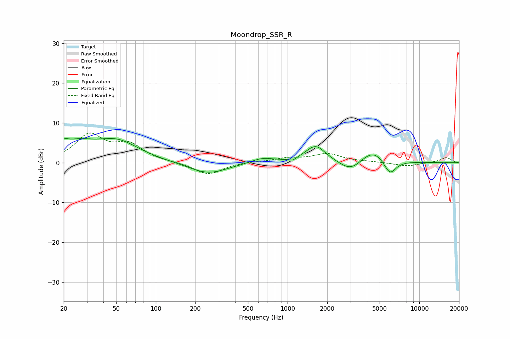

# Moondrop_SSR_R
See [usage instructions](https://github.com/jaakkopasanen/AutoEq#usage) for more options and info.

### Parametric EQs
Apply preamp of -6.2 dB when using parametric equalizer.

|   # | Type    |   Fc (Hz) |    Q |   Gain (dB) |
|-----|---------|-----------|------|-------------|
|   1 | Peaking |        20 | 4.11 |         1.8 |
|   2 | Peaking |        25 | 1.15 |         3.7 |
|   3 | Peaking |        51 | 0.84 |         5.1 |
|   4 | Peaking |       249 | 0.98 |        -2.8 |
|   5 | Peaking |       643 | 1.66 |         1.3 |
|   6 | Peaking |      1095 | 5.62 |        -0.7 |
|   7 | Peaking |      1631 | 1.85 |         4.3 |
|   8 | Peaking |      3030 | 1.66 |        -3   |
|   9 | Peaking |      4469 | 1.36 |         3.7 |
|  10 | Peaking |      5970 | 2.86 |        -4.1 |

### Fixed Band EQs
When using fixed band (also called graphic) equalizer, apply preamp of **-7.6 dB** (if available) and set gains manually with these parameters.

|   # | Type    |   Fc (Hz) |    Q |   Gain (dB) |
|-----|---------|-----------|------|-------------|
|   1 | Peaking |        31 | 1.41 |         6.7 |
|   2 | Peaking |        62 | 1.41 |         4.1 |
|   3 | Peaking |       125 | 1.41 |         0.1 |
|   4 | Peaking |       250 | 1.41 |        -3   |
|   5 | Peaking |       500 | 1.41 |         0.2 |
|   6 | Peaking |      1000 | 1.41 |         1   |
|   7 | Peaking |      2000 | 1.41 |         2.1 |
|   8 | Peaking |      4000 | 1.41 |         0.2 |
|   9 | Peaking |      8000 | 1.41 |        -0.9 |
|  10 | Peaking |     16000 | 1.41 |         1.3 |

### Graphs

