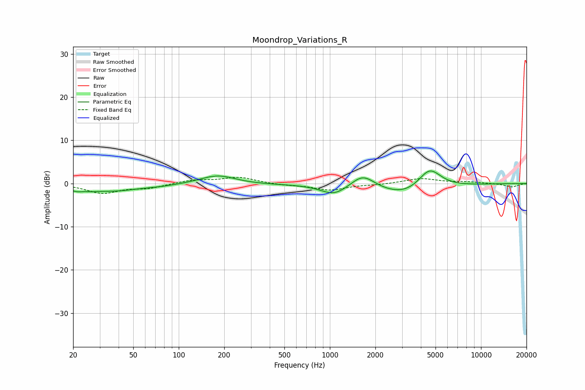

# Moondrop_Variations_R
See [usage instructions](https://github.com/jaakkopasanen/AutoEq#usage) for more options and info.

### Parametric EQs
Apply preamp of -3.0 dB when using parametric equalizer.

|   # | Type    |   Fc (Hz) |    Q |   Gain (dB) |
|-----|---------|-----------|------|-------------|
|   1 | Peaking |        23 | 2.2  |        -1.7 |
|   2 | Peaking |        23 | 4.25 |         0.6 |
|   3 | Peaking |        38 | 0.89 |        -1.5 |
|   4 | Peaking |        75 | 1.32 |        -0.3 |
|   5 | Peaking |       181 | 1.19 |         2.2 |
|   6 | Peaking |       233 | 0.37 |        -0.3 |
|   7 | Peaking |      1069 | 1.61 |        -2.4 |
|   8 | Peaking |      1652 | 1.81 |         3.2 |
|   9 | Peaking |      3342 | 0.75 |        -3.4 |
|  10 | Peaking |      4551 | 1.76 |         5.5 |

### Fixed Band EQs
When using fixed band (also called graphic) equalizer, apply preamp of **-1.5 dB** (if available) and set gains manually with these parameters.

|   # | Type    |   Fc (Hz) |    Q |   Gain (dB) |
|-----|---------|-----------|------|-------------|
|   1 | Peaking |        31 | 1.41 |        -2.2 |
|   2 | Peaking |        62 | 1.41 |        -1   |
|   3 | Peaking |       125 | 1.41 |         0.8 |
|   4 | Peaking |       250 | 1.41 |         1.4 |
|   5 | Peaking |       500 | 1.41 |        -0.3 |
|   6 | Peaking |      1000 | 1.41 |        -1.5 |
|   7 | Peaking |      2000 | 1.41 |        -0.2 |
|   8 | Peaking |      4000 | 1.41 |         1.2 |
|   9 | Peaking |      8000 | 1.41 |         0.3 |
|  10 | Peaking |     16000 | 1.41 |        -0.8 |

### Graphs

