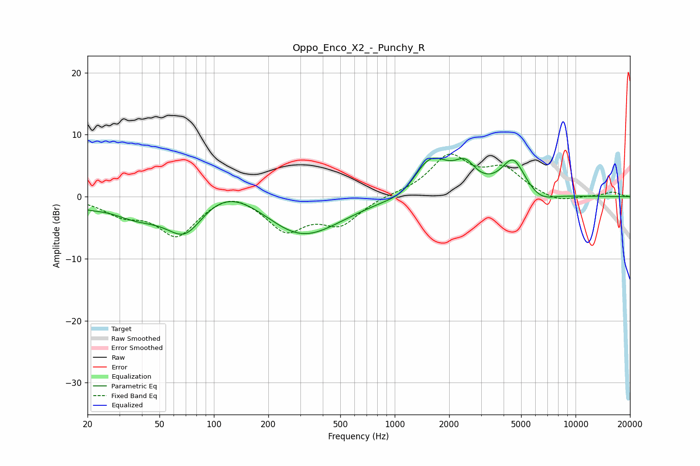

# Oppo_Enco_X2_-_Punchy_R
See [usage instructions](https://github.com/jaakkopasanen/AutoEq#usage) for more options and info.

### Parametric EQs
Apply preamp of -6.3 dB when using parametric equalizer.

|   # | Type    |   Fc (Hz) |    Q |   Gain (dB) |
|-----|---------|-----------|------|-------------|
|   1 | Peaking |        20 | 1.89 |        -0.9 |
|   2 | Peaking |        37 | 0.97 |        -2.8 |
|   3 | Peaking |        70 | 1.27 |        -6.7 |
|   4 | Peaking |       115 | 0.68 |         4.2 |
|   5 | Peaking |       303 | 0.64 |        -7   |
|   6 | Peaking |      1148 | 1.42 |        -2   |
|   7 | Peaking |      1560 | 1.26 |         7.1 |
|   8 | Peaking |      2453 | 2.56 |         3.1 |
|   9 | Peaking |      4525 | 2.14 |         5.7 |
|  10 | Peaking |      6348 | 1.79 |        -1.5 |

### Fixed Band EQs
When using fixed band (also called graphic) equalizer, apply preamp of **-7.0 dB** (if available) and set gains manually with these parameters.

|   # | Type    |   Fc (Hz) |    Q |   Gain (dB) |
|-----|---------|-----------|------|-------------|
|   1 | Peaking |        31 | 1.41 |        -2.4 |
|   2 | Peaking |        62 | 1.41 |        -6.1 |
|   3 | Peaking |       125 | 1.41 |         1.6 |
|   4 | Peaking |       250 | 1.41 |        -5.2 |
|   5 | Peaking |       500 | 1.41 |        -4.1 |
|   6 | Peaking |      1000 | 1.41 |         0.3 |
|   7 | Peaking |      2000 | 1.41 |         6.3 |
|   8 | Peaking |      4000 | 1.41 |         4   |
|   9 | Peaking |      8000 | 1.41 |        -1   |
|  10 | Peaking |     16000 | 1.41 |         0.7 |

### Graphs

