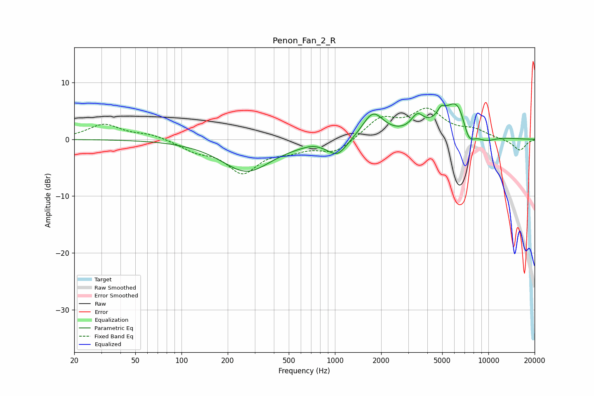

# Penon_Fan_2_R
See [usage instructions](https://github.com/jaakkopasanen/AutoEq#usage) for more options and info.

### Parametric EQs
Apply preamp of -6.3 dB when using parametric equalizer.

|   # | Type    |   Fc (Hz) |    Q |   Gain (dB) |
|-----|---------|-----------|------|-------------|
|   1 | Peaking |       266 | 0.86 |        -5.6 |
|   2 | Peaking |       712 | 2.76 |         0.3 |
|   3 | Peaking |      1039 | 2.21 |        -2.8 |
|   4 | Peaking |      1769 | 2.03 |         4.6 |
|   5 | Peaking |      3444 | 3.51 |         2.6 |
|   6 | Peaking |      4918 | 6    |         1.4 |
|   7 | Peaking |      6234 | 1.24 |         6.1 |
|   8 | Peaking |      6394 | 2.56 |         1.9 |
|   9 | Peaking |      7415 | 2.96 |        -4.6 |
|  10 | Peaking |      9410 | 1.69 |        -1.6 |

### Fixed Band EQs
When using fixed band (also called graphic) equalizer, apply preamp of **-5.6 dB** (if available) and set gains manually with these parameters.

|   # | Type    |   Fc (Hz) |    Q |   Gain (dB) |
|-----|---------|-----------|------|-------------|
|   1 | Peaking |        31 | 1.41 |         2.6 |
|   2 | Peaking |        62 | 1.41 |         0.9 |
|   3 | Peaking |       125 | 1.41 |        -1.7 |
|   4 | Peaking |       250 | 1.41 |        -5.5 |
|   5 | Peaking |       500 | 1.41 |        -1.5 |
|   6 | Peaking |      1000 | 1.41 |        -2.3 |
|   7 | Peaking |      2000 | 1.41 |         3.5 |
|   8 | Peaking |      4000 | 1.41 |         4.8 |
|   9 | Peaking |      8000 | 1.41 |         1.4 |
|  10 | Peaking |     16000 | 1.41 |        -2   |

### Graphs

