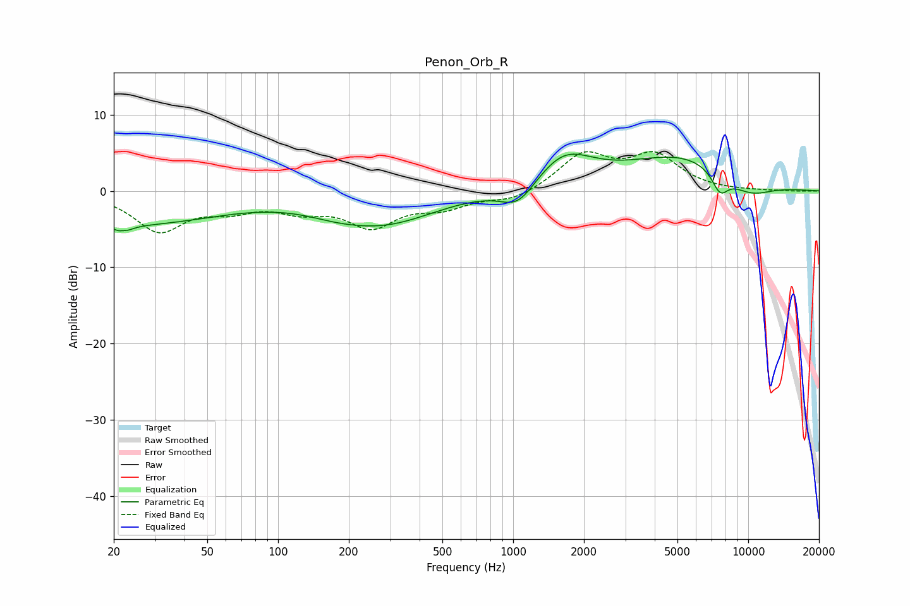

# Penon_Orb_R
See [usage instructions](https://github.com/jaakkopasanen/AutoEq#usage) for more options and info.

### Parametric EQs
Apply preamp of -4.9 dB when using parametric equalizer.

|   # | Type    |   Fc (Hz) |    Q |   Gain (dB) |
|-----|---------|-----------|------|-------------|
|   1 | Peaking |        22 | 5.16 |        -4.1 |
|   2 | Peaking |        22 | 5.97 |         3.2 |
|   3 | Peaking |        24 | 0.37 |        -4.2 |
|   4 | Peaking |       176 | 1.01 |        -0.9 |
|   5 | Peaking |       287 | 0.65 |        -3.9 |
|   6 | Peaking |      1049 | 1.9  |        -3   |
|   7 | Peaking |      1645 | 1.17 |         4.4 |
|   8 | Peaking |      5398 | 0.54 |         4.7 |
|   9 | Peaking |      7585 | 3.78 |        -2.8 |
|  10 | Peaking |     10000 | 1.12 |        -2.5 |

### Fixed Band EQs
When using fixed band (also called graphic) equalizer, apply preamp of **-5.3 dB** (if available) and set gains manually with these parameters.

|   # | Type    |   Fc (Hz) |    Q |   Gain (dB) |
|-----|---------|-----------|------|-------------|
|   1 | Peaking |        31 | 1.41 |        -5   |
|   2 | Peaking |        62 | 1.41 |        -1.9 |
|   3 | Peaking |       125 | 1.41 |        -2   |
|   4 | Peaking |       250 | 1.41 |        -4.3 |
|   5 | Peaking |       500 | 1.41 |        -1.9 |
|   6 | Peaking |      1000 | 1.41 |        -1.3 |
|   7 | Peaking |      2000 | 1.41 |         4.7 |
|   8 | Peaking |      4000 | 1.41 |         4.4 |
|   9 | Peaking |      8000 | 1.41 |        -0   |
|  10 | Peaking |     16000 | 1.41 |        -0   |

### Graphs

