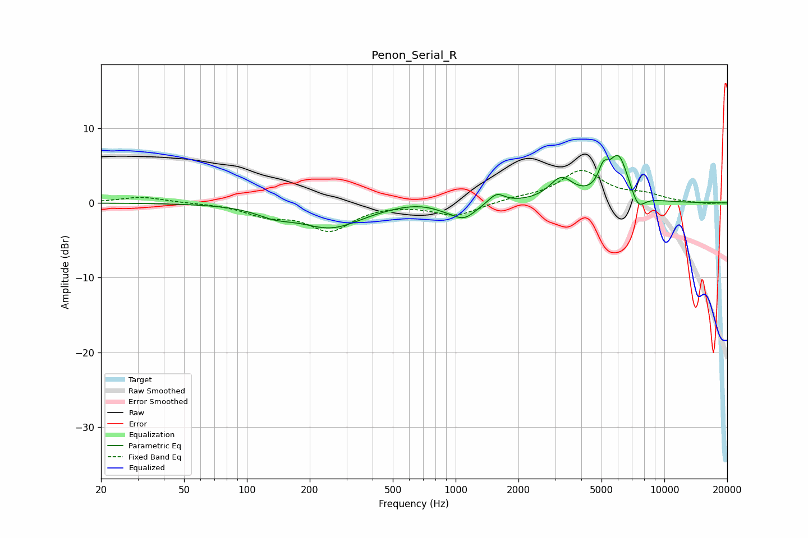

# Penon_Serial_R
See [usage instructions](https://github.com/jaakkopasanen/AutoEq#usage) for more options and info.

### Parametric EQs
Apply preamp of -6.5 dB when using parametric equalizer.

|   # | Type    |   Fc (Hz) |    Q |   Gain (dB) |
|-----|---------|-----------|------|-------------|
|   1 | Peaking |       135 | 1.62 |        -1.1 |
|   2 | Peaking |       253 | 0.94 |        -3.2 |
|   3 | Peaking |       659 | 1.19 |         0.5 |
|   4 | Peaking |       913 | 1.86 |        -0.7 |
|   5 | Peaking |      1104 | 2.56 |        -1.7 |
|   6 | Peaking |      1569 | 3.74 |         1.4 |
|   7 | Peaking |      3206 | 2.48 |         3   |
|   8 | Peaking |      5098 | 5.98 |         2.4 |
|   9 | Peaking |      6031 | 2.76 |         6.1 |
|  10 | Peaking |      7474 | 3.94 |        -2.3 |

### Fixed Band EQs
When using fixed band (also called graphic) equalizer, apply preamp of **-4.4 dB** (if available) and set gains manually with these parameters.

|   # | Type    |   Fc (Hz) |    Q |   Gain (dB) |
|-----|---------|-----------|------|-------------|
|   1 | Peaking |        31 | 1.41 |         0.8 |
|   2 | Peaking |        62 | 1.41 |         0   |
|   3 | Peaking |       125 | 1.41 |        -1.5 |
|   4 | Peaking |       250 | 1.41 |        -3.5 |
|   5 | Peaking |       500 | 1.41 |         0   |
|   6 | Peaking |      1000 | 1.41 |        -1.7 |
|   7 | Peaking |      2000 | 1.41 |         0.5 |
|   8 | Peaking |      4000 | 1.41 |         4.2 |
|   9 | Peaking |      8000 | 1.41 |         0.9 |
|  10 | Peaking |     16000 | 1.41 |        -0.1 |

### Graphs

