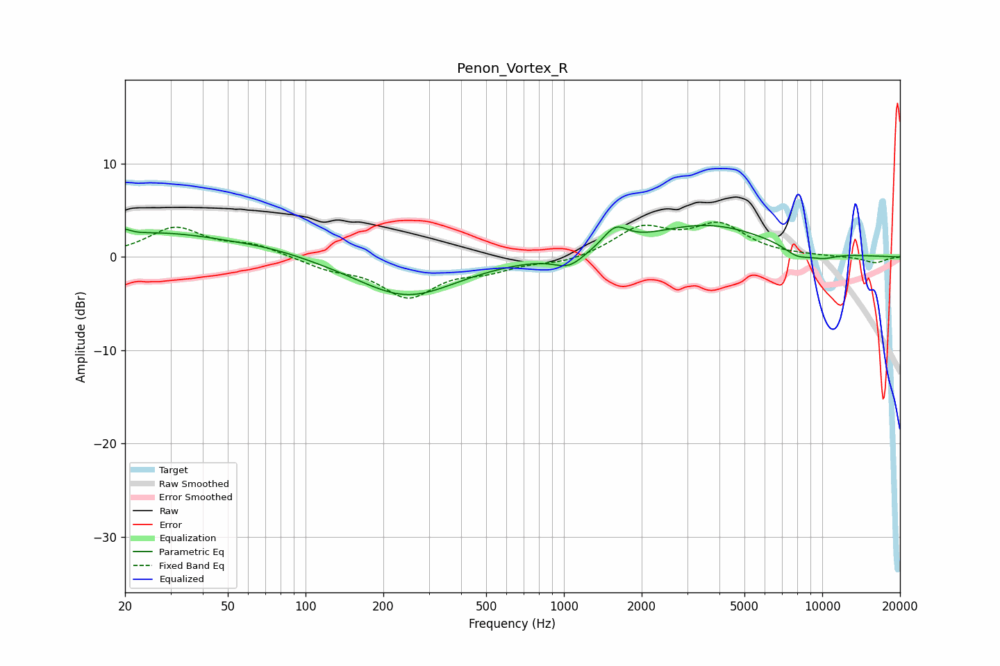

# Penon_Vortex_R
See [usage instructions](https://github.com/jaakkopasanen/AutoEq#usage) for more options and info.

### Parametric EQs
Apply preamp of -3.5 dB when using parametric equalizer.

|   # | Type    |   Fc (Hz) |    Q |   Gain (dB) |
|-----|---------|-----------|------|-------------|
|   1 | Peaking |        20 | 5.94 |         2.6 |
|   2 | Peaking |        20 | 5.98 |        -1.9 |
|   3 | Peaking |        27 | 0.5  |         2.5 |
|   4 | Peaking |        74 | 0.89 |         0.5 |
|   5 | Peaking |       247 | 0.73 |        -4.2 |
|   6 | Peaking |      1048 | 2.41 |        -1.5 |
|   7 | Peaking |      1583 | 3    |         2   |
|   8 | Peaking |      3558 | 0.58 |         3.4 |
|   9 | Peaking |      7973 | 2.54 |        -1   |
|  10 | Peaking |     10000 | 2.05 |        -0.7 |

### Fixed Band EQs
When using fixed band (also called graphic) equalizer, apply preamp of **-3.8 dB** (if available) and set gains manually with these parameters.

|   # | Type    |   Fc (Hz) |    Q |   Gain (dB) |
|-----|---------|-----------|------|-------------|
|   1 | Peaking |        31 | 1.41 |         3   |
|   2 | Peaking |        62 | 1.41 |         1.2 |
|   3 | Peaking |       125 | 1.41 |        -1.1 |
|   4 | Peaking |       250 | 1.41 |        -4.1 |
|   5 | Peaking |       500 | 1.41 |        -1.2 |
|   6 | Peaking |      1000 | 1.41 |        -0.7 |
|   7 | Peaking |      2000 | 1.41 |         3   |
|   8 | Peaking |      4000 | 1.41 |         3.2 |
|   9 | Peaking |      8000 | 1.41 |         0.1 |
|  10 | Peaking |     16000 | 1.41 |        -0.7 |

### Graphs

