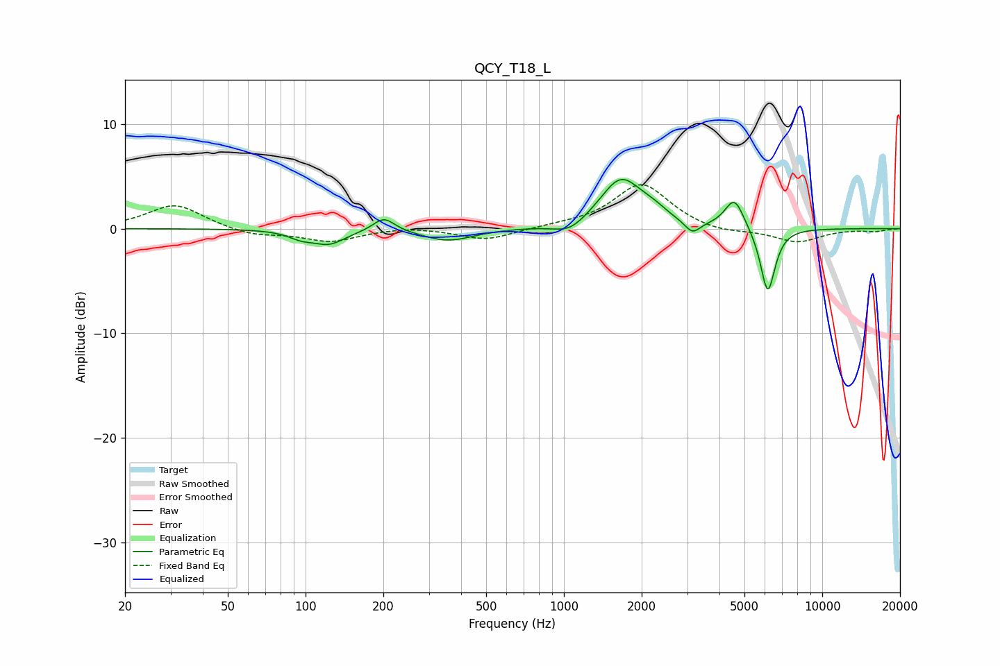

# QCY_T18_L
See [usage instructions](https://github.com/jaakkopasanen/AutoEq#usage) for more options and info.

### Parametric EQs
Apply preamp of -4.8 dB when using parametric equalizer.

|   # | Type    |   Fc (Hz) |    Q |   Gain (dB) |
|-----|---------|-----------|------|-------------|
|   1 | Peaking |        96 | 2.93 |        -0.6 |
|   2 | Peaking |       123 | 2.22 |        -1.3 |
|   3 | Peaking |       201 | 3.4  |         1.4 |
|   4 | Peaking |       356 | 1.44 |        -1.2 |
|   5 | Peaking |      1053 | 2.21 |        -1.1 |
|   6 | Peaking |      1663 | 1.72 |         4.7 |
|   7 | Peaking |      2224 | 2.76 |         0.7 |
|   8 | Peaking |      3145 | 4.61 |        -1.2 |
|   9 | Peaking |      4574 | 3.8  |         2.9 |
|  10 | Peaking |      6154 | 4.78 |        -6.3 |

### Fixed Band EQs
When using fixed band (also called graphic) equalizer, apply preamp of **-4.3 dB** (if available) and set gains manually with these parameters.

|   # | Type    |   Fc (Hz) |    Q |   Gain (dB) |
|-----|---------|-----------|------|-------------|
|   1 | Peaking |        31 | 1.41 |         2.3 |
|   2 | Peaking |        62 | 1.41 |        -0.7 |
|   3 | Peaking |       125 | 1.41 |        -1.2 |
|   4 | Peaking |       250 | 1.41 |         0.2 |
|   5 | Peaking |       500 | 1.41 |        -1.1 |
|   6 | Peaking |      1000 | 1.41 |         0.2 |
|   7 | Peaking |      2000 | 1.41 |         4.3 |
|   8 | Peaking |      4000 | 1.41 |        -0.5 |
|   9 | Peaking |      8000 | 1.41 |        -1.3 |
|  10 | Peaking |     16000 | 1.41 |        -0.2 |

### Graphs

