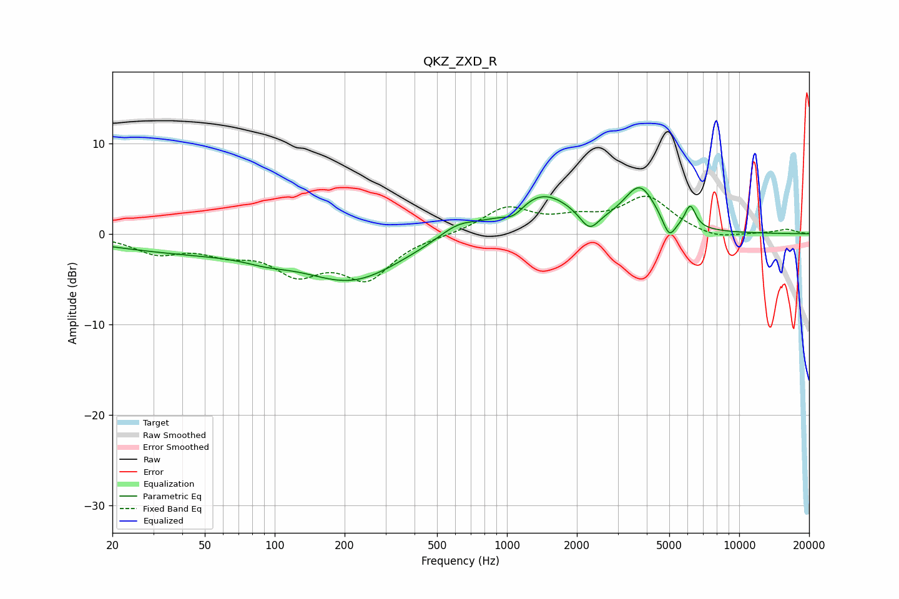

# QKZ_ZXD_R
See [usage instructions](https://github.com/jaakkopasanen/AutoEq#usage) for more options and info.

### Parametric EQs
Apply preamp of -5.2 dB when using parametric equalizer.

|   # | Type    |   Fc (Hz) |    Q |   Gain (dB) |
|-----|---------|-----------|------|-------------|
|   1 | Peaking |        42 | 0.39 |        -1.9 |
|   2 | Peaking |        93 | 1.5  |        -0.6 |
|   3 | Peaking |       217 | 0.66 |        -4.8 |
|   4 | Peaking |       612 | 1.69 |         1.4 |
|   5 | Peaking |      1069 | 3.06 |        -1.2 |
|   6 | Peaking |      1398 | 0.99 |         4.5 |
|   7 | Peaking |      2267 | 3.45 |        -2.1 |
|   8 | Peaking |      3737 | 2.04 |         4.7 |
|   9 | Peaking |      4997 | 5.04 |        -2.2 |
|  10 | Peaking |      6158 | 6    |         2.5 |

### Fixed Band EQs
When using fixed band (also called graphic) equalizer, apply preamp of **-4.2 dB** (if available) and set gains manually with these parameters.

|   # | Type    |   Fc (Hz) |    Q |   Gain (dB) |
|-----|---------|-----------|------|-------------|
|   1 | Peaking |        31 | 1.41 |        -1.9 |
|   2 | Peaking |        62 | 1.41 |        -1.7 |
|   3 | Peaking |       125 | 1.41 |        -3.8 |
|   4 | Peaking |       250 | 1.41 |        -4.6 |
|   5 | Peaking |       500 | 1.41 |        -0.1 |
|   6 | Peaking |      1000 | 1.41 |         2.8 |
|   7 | Peaking |      2000 | 1.41 |         1.3 |
|   8 | Peaking |      4000 | 1.41 |         3.9 |
|   9 | Peaking |      8000 | 1.41 |        -0.7 |
|  10 | Peaking |     16000 | 1.41 |         0.5 |

### Graphs

