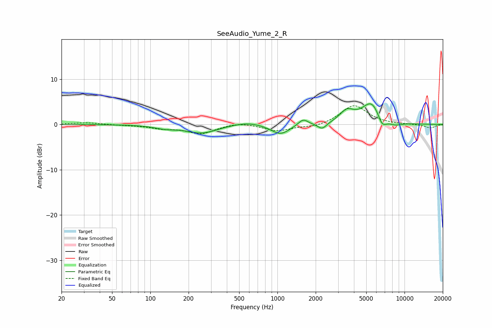

# SeeAudio_Yume_2_R
See [usage instructions](https://github.com/jaakkopasanen/AutoEq#usage) for more options and info.

### Parametric EQs
Apply preamp of -4.7 dB when using parametric equalizer.

|   # | Type    |   Fc (Hz) |    Q |   Gain (dB) |
|-----|---------|-----------|------|-------------|
|   1 | Peaking |       131 | 1.63 |        -0.7 |
|   2 | Peaking |       254 | 1.18 |        -1.8 |
|   3 | Peaking |       579 | 1.25 |         0.7 |
|   4 | Peaking |      1056 | 1.92 |        -2.2 |
|   5 | Peaking |      1593 | 3.73 |         1.4 |
|   6 | Peaking |      2250 | 4.05 |        -1.4 |
|   7 | Peaking |      3507 | 2.58 |         2.5 |
|   8 | Peaking |      5544 | 1.76 |         5.1 |
|   9 | Peaking |      6651 | 3.6  |        -2.8 |
|  10 | Peaking |      8361 | 2.32 |        -0.9 |

### Fixed Band EQs
When using fixed band (also called graphic) equalizer, apply preamp of **-4.2 dB** (if available) and set gains manually with these parameters.

|   # | Type    |   Fc (Hz) |    Q |   Gain (dB) |
|-----|---------|-----------|------|-------------|
|   1 | Peaking |        31 | 1.41 |         0.4 |
|   2 | Peaking |        62 | 1.41 |        -0.1 |
|   3 | Peaking |       125 | 1.41 |        -0.7 |
|   4 | Peaking |       250 | 1.41 |        -2   |
|   5 | Peaking |       500 | 1.41 |         0.6 |
|   6 | Peaking |      1000 | 1.41 |        -1.4 |
|   7 | Peaking |      2000 | 1.41 |        -0.6 |
|   8 | Peaking |      4000 | 1.41 |         4.3 |
|   9 | Peaking |      8000 | 1.41 |        -0   |
|  10 | Peaking |     16000 | 1.41 |        -0.8 |

### Graphs

