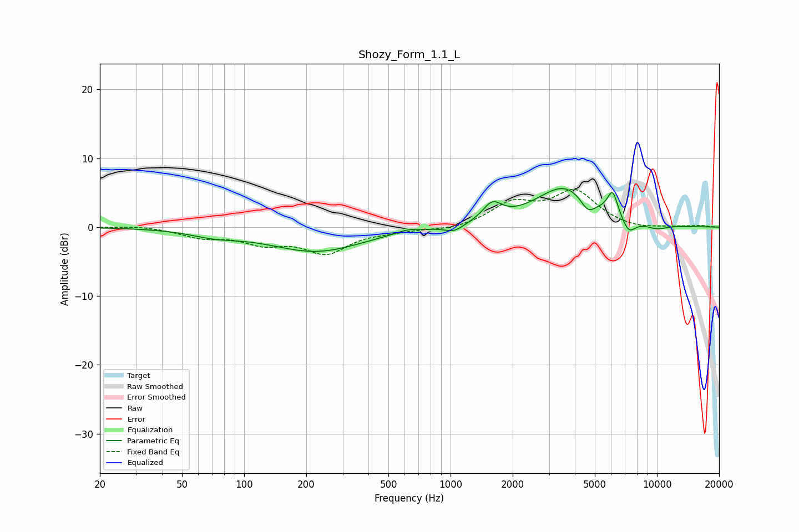

# Shozy_Form_1.1_L
See [usage instructions](https://github.com/jaakkopasanen/AutoEq#usage) for more options and info.

### Parametric EQs
Apply preamp of -5.7 dB when using parametric equalizer.

|   # | Type    |   Fc (Hz) |    Q |   Gain (dB) |
|-----|---------|-----------|------|-------------|
|   1 | Peaking |        72 | 1.16 |        -0.9 |
|   2 | Peaking |       224 | 0.63 |        -3.5 |
|   3 | Peaking |       618 | 2.54 |         0.5 |
|   4 | Peaking |      1042 | 3.09 |        -1   |
|   5 | Peaking |      1592 | 3.07 |         2.5 |
|   6 | Peaking |      3598 | 0.96 |         5.9 |
|   7 | Peaking |      4624 | 3.74 |        -2.2 |
|   8 | Peaking |      6098 | 5.5  |         3.5 |
|   9 | Peaking |      7296 | 3.96 |        -2.2 |
|  10 | Peaking |      9942 | 2.2  |        -0.8 |

### Fixed Band EQs
When using fixed band (also called graphic) equalizer, apply preamp of **-5.6 dB** (if available) and set gains manually with these parameters.

|   # | Type    |   Fc (Hz) |    Q |   Gain (dB) |
|-----|---------|-----------|------|-------------|
|   1 | Peaking |        31 | 1.41 |         0.3 |
|   2 | Peaking |        62 | 1.41 |        -1.3 |
|   3 | Peaking |       125 | 1.41 |        -2   |
|   4 | Peaking |       250 | 1.41 |        -3.5 |
|   5 | Peaking |       500 | 1.41 |        -0.4 |
|   6 | Peaking |      1000 | 1.41 |        -0.5 |
|   7 | Peaking |      2000 | 1.41 |         3.2 |
|   8 | Peaking |      4000 | 1.41 |         5   |
|   9 | Peaking |      8000 | 1.41 |        -0.4 |
|  10 | Peaking |     16000 | 1.41 |         0.2 |

### Graphs

