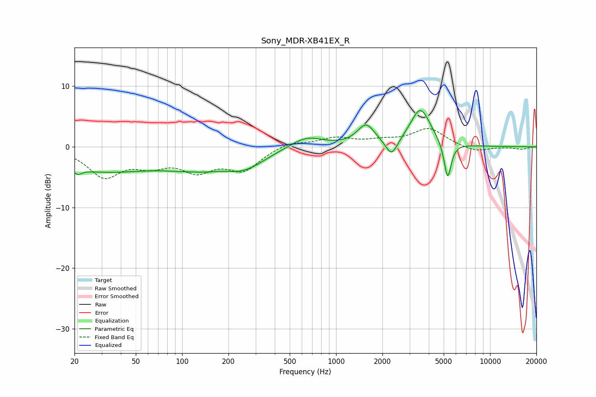

# Sony_MDR-XB41EX_R
See [usage instructions](https://github.com/jaakkopasanen/AutoEq#usage) for more options and info.

### Parametric EQs
Apply preamp of -6.1 dB when using parametric equalizer.

|   # | Type    |   Fc (Hz) |    Q |   Gain (dB) |
|-----|---------|-----------|------|-------------|
|   1 | Peaking |        21 | 5.69 |        -0.9 |
|   2 | Peaking |        31 | 0.39 |        -3.9 |
|   3 | Peaking |        94 | 0.98 |        -1   |
|   4 | Peaking |       140 | 1.13 |        -1.4 |
|   5 | Peaking |       251 | 1.01 |        -3.1 |
|   6 | Peaking |       642 | 1.35 |         1.9 |
|   7 | Peaking |      1566 | 2.51 |         3.4 |
|   8 | Peaking |      2297 | 3.7  |        -2.9 |
|   9 | Peaking |      3531 | 2.14 |         6.3 |
|  10 | Peaking |      5304 | 6    |        -6.2 |

### Fixed Band EQs
When using fixed band (also called graphic) equalizer, apply preamp of **-3.1 dB** (if available) and set gains manually with these parameters.

|   # | Type    |   Fc (Hz) |    Q |   Gain (dB) |
|-----|---------|-----------|------|-------------|
|   1 | Peaking |        31 | 1.41 |        -4.7 |
|   2 | Peaking |        62 | 1.41 |        -2.4 |
|   3 | Peaking |       125 | 1.41 |        -3.4 |
|   4 | Peaking |       250 | 1.41 |        -3.6 |
|   5 | Peaking |       500 | 1.41 |         0.9 |
|   6 | Peaking |      1000 | 1.41 |         1.4 |
|   7 | Peaking |      2000 | 1.41 |         0.8 |
|   8 | Peaking |      4000 | 1.41 |         3   |
|   9 | Peaking |      8000 | 1.41 |        -0.9 |
|  10 | Peaking |     16000 | 1.41 |        -0.4 |

### Graphs

