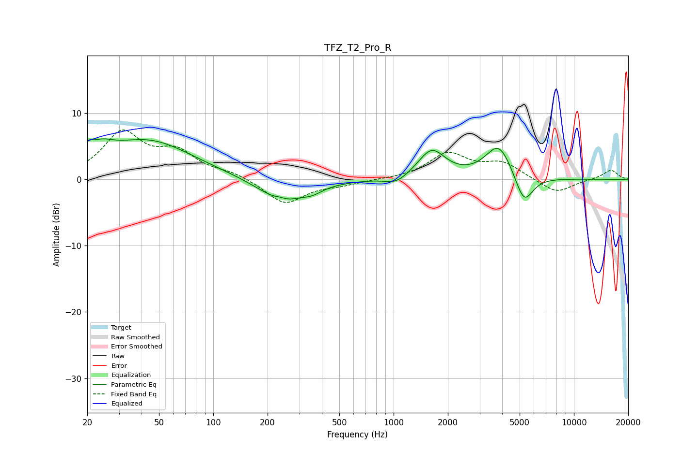

# TFZ_T2_Pro_R
See [usage instructions](https://github.com/jaakkopasanen/AutoEq#usage) for more options and info.

### Parametric EQs
Apply preamp of -6.2 dB when using parametric equalizer.

|   # | Type    |   Fc (Hz) |    Q |   Gain (dB) |
|-----|---------|-----------|------|-------------|
|   1 | Peaking |        20 | 5.07 |         1.5 |
|   2 | Peaking |        24 | 2.04 |         2   |
|   3 | Peaking |        43 | 0.56 |         5.8 |
|   4 | Peaking |       233 | 5.91 |         0.2 |
|   5 | Peaking |       242 | 1.05 |        -3.5 |
|   6 | Peaking |       355 | 2.67 |        -0.7 |
|   7 | Peaking |      1035 | 2.27 |        -1.2 |
|   8 | Peaking |      1627 | 1.88 |         4.3 |
|   9 | Peaking |      3835 | 1.9  |         5.3 |
|  10 | Peaking |      5285 | 2.79 |        -4.6 |

### Fixed Band EQs
When using fixed band (also called graphic) equalizer, apply preamp of **-7.6 dB** (if available) and set gains manually with these parameters.

|   # | Type    |   Fc (Hz) |    Q |   Gain (dB) |
|-----|---------|-----------|------|-------------|
|   1 | Peaking |        31 | 1.41 |         6.8 |
|   2 | Peaking |        62 | 1.41 |         3.6 |
|   3 | Peaking |       125 | 1.41 |         0.9 |
|   4 | Peaking |       250 | 1.41 |        -3.7 |
|   5 | Peaking |       500 | 1.41 |        -0.7 |
|   6 | Peaking |      1000 | 1.41 |        -0   |
|   7 | Peaking |      2000 | 1.41 |         3.8 |
|   8 | Peaking |      4000 | 1.41 |         2.3 |
|   9 | Peaking |      8000 | 1.41 |        -2.1 |
|  10 | Peaking |     16000 | 1.41 |         1.4 |

### Graphs

