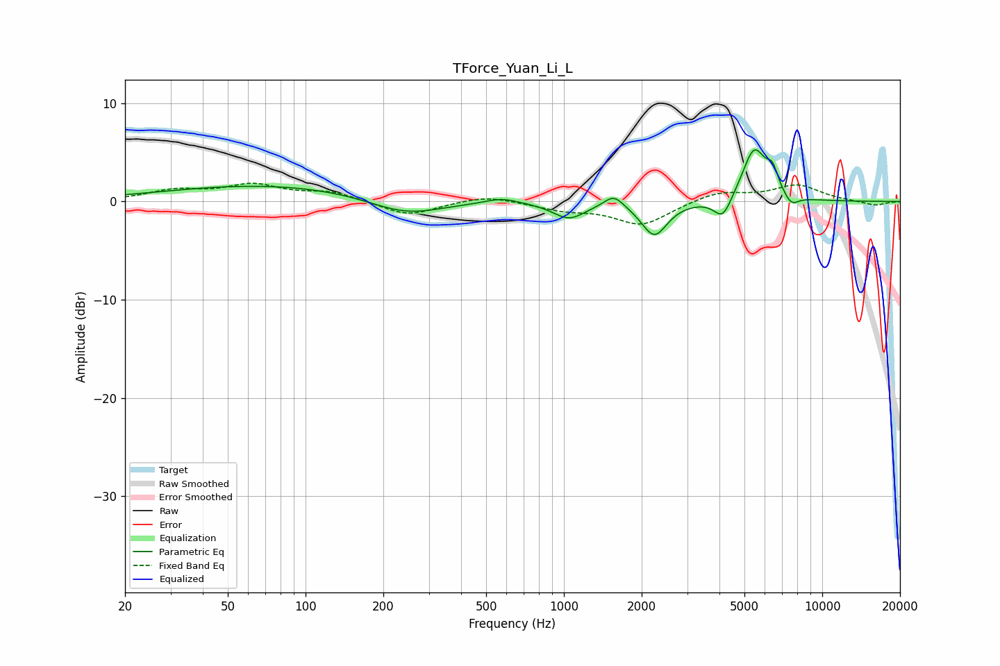

# TForce_Yuan_Li_L
See [usage instructions](https://github.com/jaakkopasanen/AutoEq#usage) for more options and info.

### Parametric EQs
Apply preamp of -5.4 dB when using parametric equalizer.

|   # | Type    |   Fc (Hz) |    Q |   Gain (dB) |
|-----|---------|-----------|------|-------------|
|   1 | Peaking |        72 | 0.35 |         1.7 |
|   2 | Peaking |       244 | 0.99 |        -1.7 |
|   3 | Peaking |       574 | 2.25 |         0.6 |
|   4 | Peaking |      1046 | 2.26 |        -1.7 |
|   5 | Peaking |      1561 | 3.82 |         1.3 |
|   6 | Peaking |      2240 | 2.84 |        -3.5 |
|   7 | Peaking |      4122 | 4.06 |        -2.3 |
|   8 | Peaking |      5454 | 2.96 |         5.4 |
|   9 | Peaking |      6421 | 6    |         2   |
|  10 | Peaking |      7585 | 4.75 |        -1.1 |

### Fixed Band EQs
When using fixed band (also called graphic) equalizer, apply preamp of **-2.0 dB** (if available) and set gains manually with these parameters.

|   # | Type    |   Fc (Hz) |    Q |   Gain (dB) |
|-----|---------|-----------|------|-------------|
|   1 | Peaking |        31 | 1.41 |         1   |
|   2 | Peaking |        62 | 1.41 |         1.6 |
|   3 | Peaking |       125 | 1.41 |         0.9 |
|   4 | Peaking |       250 | 1.41 |        -1.5 |
|   5 | Peaking |       500 | 1.41 |         0.7 |
|   6 | Peaking |      1000 | 1.41 |        -0.8 |
|   7 | Peaking |      2000 | 1.41 |        -2.4 |
|   8 | Peaking |      4000 | 1.41 |         1   |
|   9 | Peaking |      8000 | 1.41 |         1.6 |
|  10 | Peaking |     16000 | 1.41 |        -0.4 |

### Graphs

