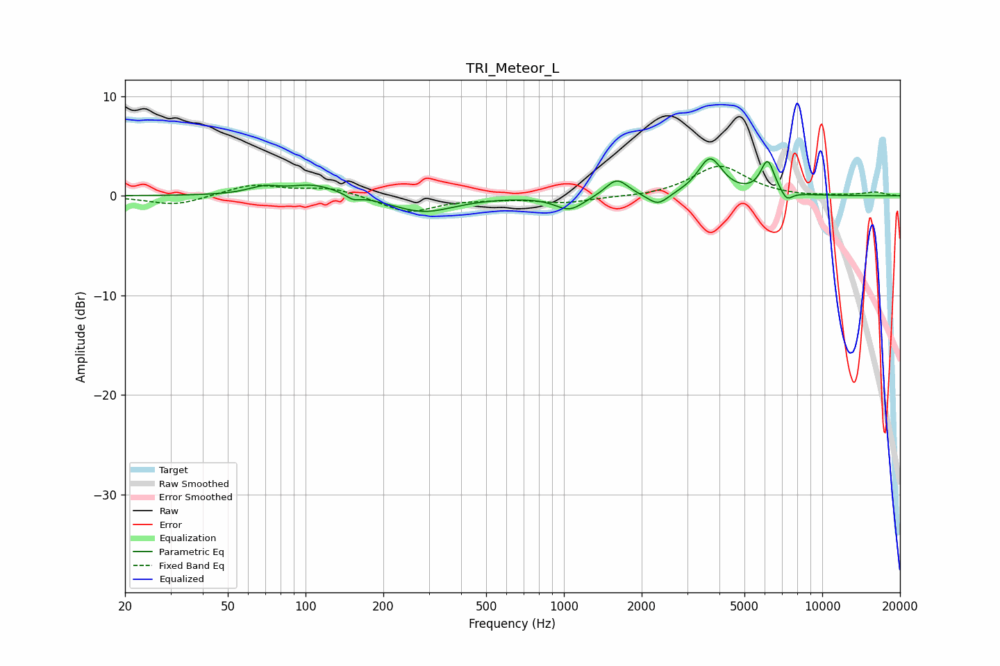

# TRI_Meteor_L
See [usage instructions](https://github.com/jaakkopasanen/AutoEq#usage) for more options and info.

### Parametric EQs
Apply preamp of -3.8 dB when using parametric equalizer.

|   # | Type    |   Fc (Hz) |    Q |   Gain (dB) |
|-----|---------|-----------|------|-------------|
|   1 | Peaking |        69 | 2.34 |         0.7 |
|   2 | Peaking |       108 | 1.48 |         1.1 |
|   3 | Peaking |       153 | 5.74 |        -0.5 |
|   4 | Peaking |       286 | 1.17 |        -1.6 |
|   5 | Peaking |      1052 | 2.57 |        -1.4 |
|   6 | Peaking |      1602 | 3.28 |         1.8 |
|   7 | Peaking |      2313 | 3.53 |        -1.2 |
|   8 | Peaking |      3679 | 2.96 |         3.7 |
|   9 | Peaking |      6143 | 5.07 |         3.3 |
|  10 | Peaking |      7284 | 5.99 |        -1   |

### Fixed Band EQs
When using fixed band (also called graphic) equalizer, apply preamp of **-3.1 dB** (if available) and set gains manually with these parameters.

|   # | Type    |   Fc (Hz) |    Q |   Gain (dB) |
|-----|---------|-----------|------|-------------|
|   1 | Peaking |        31 | 1.41 |        -1   |
|   2 | Peaking |        62 | 1.41 |         1.1 |
|   3 | Peaking |       125 | 1.41 |         0.8 |
|   4 | Peaking |       250 | 1.41 |        -1.7 |
|   5 | Peaking |       500 | 1.41 |        -0.2 |
|   6 | Peaking |      1000 | 1.41 |        -0.7 |
|   7 | Peaking |      2000 | 1.41 |        -0.1 |
|   8 | Peaking |      4000 | 1.41 |         3   |
|   9 | Peaking |      8000 | 1.41 |        -0.1 |
|  10 | Peaking |     16000 | 1.41 |         0.4 |

### Graphs

