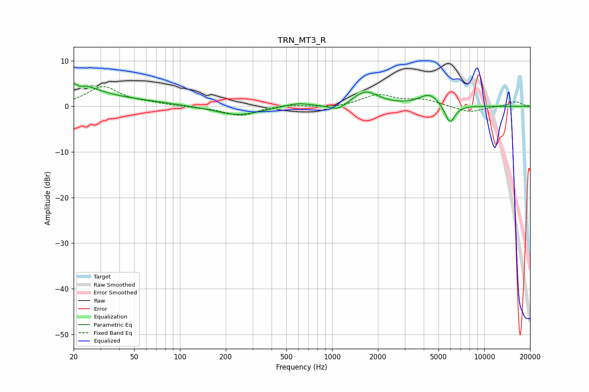

# TRN_MT3_R
See [usage instructions](https://github.com/jaakkopasanen/AutoEq#usage) for more options and info.

### Parametric EQs
Apply preamp of -5.0 dB when using parametric equalizer.

|   # | Type    |   Fc (Hz) |    Q |   Gain (dB) |
|-----|---------|-----------|------|-------------|
|   1 | Peaking |        21 | 5.39 |         3.1 |
|   2 | Peaking |        21 | 5.96 |        -2.6 |
|   3 | Peaking |        22 | 1.12 |         3.6 |
|   4 | Peaking |        43 | 0.52 |         1.2 |
|   5 | Peaking |       239 | 0.96 |        -2   |
|   6 | Peaking |       593 | 1.72 |         0.8 |
|   7 | Peaking |      1095 | 2.46 |        -1.5 |
|   8 | Peaking |      1654 | 1.65 |         3.3 |
|   9 | Peaking |      4382 | 2.02 |         2.7 |
|  10 | Peaking |      5938 | 3.99 |        -4.3 |

### Fixed Band EQs
When using fixed band (also called graphic) equalizer, apply preamp of **-4.4 dB** (if available) and set gains manually with these parameters.

|   # | Type    |   Fc (Hz) |    Q |   Gain (dB) |
|-----|---------|-----------|------|-------------|
|   1 | Peaking |        31 | 1.41 |         4.3 |
|   2 | Peaking |        62 | 1.41 |         0.5 |
|   3 | Peaking |       125 | 1.41 |        -0.2 |
|   4 | Peaking |       250 | 1.41 |        -2.1 |
|   5 | Peaking |       500 | 1.41 |         0.5 |
|   6 | Peaking |      1000 | 1.41 |        -0.4 |
|   7 | Peaking |      2000 | 1.41 |         2.5 |
|   8 | Peaking |      4000 | 1.41 |         1.3 |
|   9 | Peaking |      8000 | 1.41 |        -1.4 |
|  10 | Peaking |     16000 | 1.41 |         1   |

### Graphs

