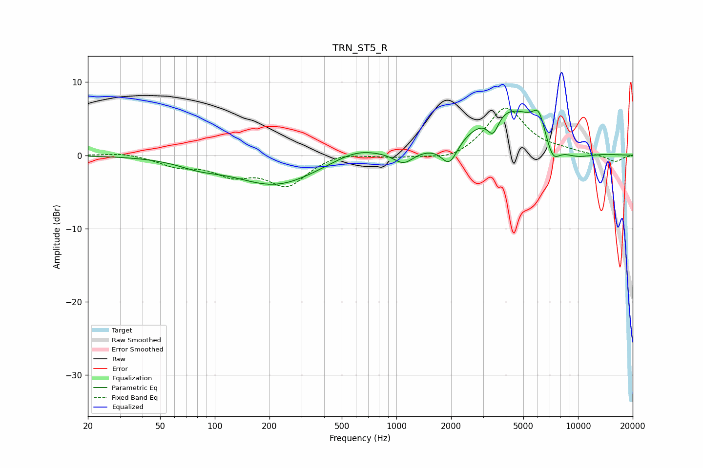

# TRN_ST5_R
See [usage instructions](https://github.com/jaakkopasanen/AutoEq#usage) for more options and info.

### Parametric EQs
Apply preamp of -6.2 dB when using parametric equalizer.

|   # | Type    |   Fc (Hz) |    Q |   Gain (dB) |
|-----|---------|-----------|------|-------------|
|   1 | Peaking |        82 | 1.22 |        -0.9 |
|   2 | Peaking |       217 | 0.63 |        -4   |
|   3 | Peaking |       600 | 1.1  |         1.4 |
|   4 | Peaking |      1095 | 2.55 |        -1.7 |
|   5 | Peaking |      1959 | 3.09 |        -3.3 |
|   6 | Peaking |      3402 | 4.51 |        -2.7 |
|   7 | Peaking |      4134 | 0.72 |         6.7 |
|   8 | Peaking |      6090 | 3.95 |         2.9 |
|   9 | Peaking |      7243 | 3.22 |        -3.1 |
|  10 | Peaking |      9436 | 1.19 |        -1.6 |

### Fixed Band EQs
When using fixed band (also called graphic) equalizer, apply preamp of **-6.5 dB** (if available) and set gains manually with these parameters.

|   # | Type    |   Fc (Hz) |    Q |   Gain (dB) |
|-----|---------|-----------|------|-------------|
|   1 | Peaking |        31 | 1.41 |         0.4 |
|   2 | Peaking |        62 | 1.41 |        -1.3 |
|   3 | Peaking |       125 | 1.41 |        -2.3 |
|   4 | Peaking |       250 | 1.41 |        -3.9 |
|   5 | Peaking |       500 | 1.41 |         0.6 |
|   6 | Peaking |      1000 | 1.41 |        -0.3 |
|   7 | Peaking |      2000 | 1.41 |        -0.9 |
|   8 | Peaking |      4000 | 1.41 |         6.6 |
|   9 | Peaking |      8000 | 1.41 |         0.5 |
|  10 | Peaking |     16000 | 1.41 |        -0.9 |

### Graphs

