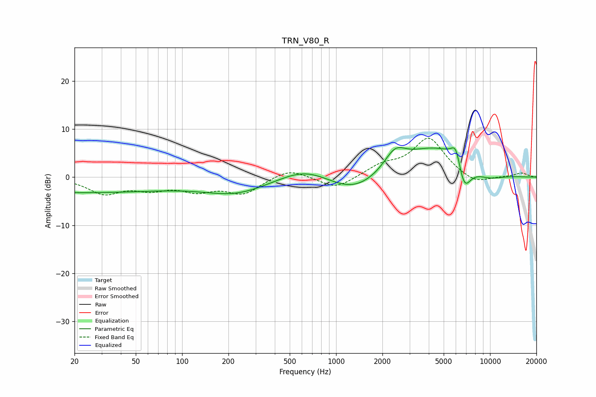

# TRN_V80_R
See [usage instructions](https://github.com/jaakkopasanen/AutoEq#usage) for more options and info.

### Parametric EQs
Apply preamp of -6.3 dB when using parametric equalizer.

|   # | Type    |   Fc (Hz) |    Q |   Gain (dB) |
|-----|---------|-----------|------|-------------|
|   1 | Peaking |        20 | 0.2  |        -3.2 |
|   2 | Peaking |       223 | 0.66 |        -3.1 |
|   3 | Peaking |       630 | 0.87 |         2.7 |
|   4 | Peaking |      1308 | 0.81 |        -3.8 |
|   5 | Peaking |      2416 | 1.98 |         4.1 |
|   6 | Peaking |      4210 | 0.71 |         5.8 |
|   7 | Peaking |      5935 | 1.83 |         1.8 |
|   8 | Peaking |      6003 | 4.79 |         3.5 |
|   9 | Peaking |      6776 | 2.99 |        -6.5 |
|  10 | Peaking |      9749 | 1.29 |        -1.3 |

### Fixed Band EQs
When using fixed band (also called graphic) equalizer, apply preamp of **-8.2 dB** (if available) and set gains manually with these parameters.

|   # | Type    |   Fc (Hz) |    Q |   Gain (dB) |
|-----|---------|-----------|------|-------------|
|   1 | Peaking |        31 | 1.41 |        -3.2 |
|   2 | Peaking |        62 | 1.41 |        -2.1 |
|   3 | Peaking |       125 | 1.41 |        -2.4 |
|   4 | Peaking |       250 | 1.41 |        -3.2 |
|   5 | Peaking |       500 | 1.41 |         1.9 |
|   6 | Peaking |      1000 | 1.41 |        -2.5 |
|   7 | Peaking |      2000 | 1.41 |         2.1 |
|   8 | Peaking |      4000 | 1.41 |         8.1 |
|   9 | Peaking |      8000 | 1.41 |        -1.7 |
|  10 | Peaking |     16000 | 1.41 |         0.9 |

### Graphs

