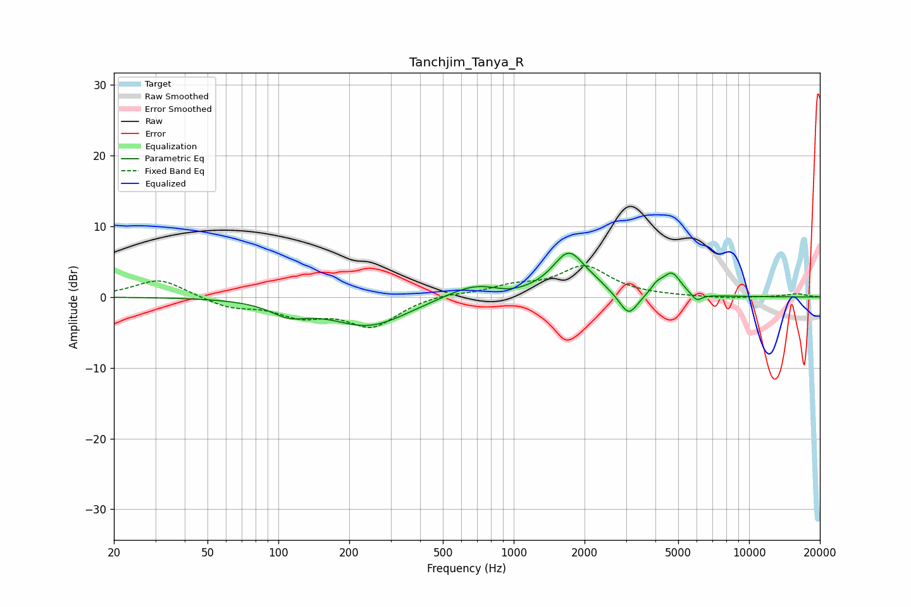

# Tanchjim_Tanya_R
See [usage instructions](https://github.com/jaakkopasanen/AutoEq#usage) for more options and info.

### Parametric EQs
Apply preamp of -6.3 dB when using parametric equalizer.

|   # | Type    |   Fc (Hz) |    Q |   Gain (dB) |
|-----|---------|-----------|------|-------------|
|   1 | Peaking |       111 | 1.81 |        -1.8 |
|   2 | Peaking |       243 | 0.86 |        -4.1 |
|   3 | Peaking |       686 | 1.13 |         2.1 |
|   4 | Peaking |       946 | 1.96 |        -0.6 |
|   5 | Peaking |      1716 | 2.03 |         6.1 |
|   6 | Peaking |      2212 | 3.36 |         0.5 |
|   7 | Peaking |      3079 | 3.57 |        -3.3 |
|   8 | Peaking |      4058 | 5.48 |         1.1 |
|   9 | Peaking |      4693 | 3.57 |         3.2 |
|  10 | Peaking |      5991 | 6    |        -1.1 |

### Fixed Band EQs
When using fixed band (also called graphic) equalizer, apply preamp of **-4.5 dB** (if available) and set gains manually with these parameters.

|   # | Type    |   Fc (Hz) |    Q |   Gain (dB) |
|-----|---------|-----------|------|-------------|
|   1 | Peaking |        31 | 1.41 |         2.6 |
|   2 | Peaking |        62 | 1.41 |        -1.4 |
|   3 | Peaking |       125 | 1.41 |        -2.3 |
|   4 | Peaking |       250 | 1.41 |        -4   |
|   5 | Peaking |       500 | 1.41 |         0.5 |
|   6 | Peaking |      1000 | 1.41 |         1.3 |
|   7 | Peaking |      2000 | 1.41 |         4.2 |
|   8 | Peaking |      4000 | 1.41 |         0   |
|   9 | Peaking |      8000 | 1.41 |        -0.2 |
|  10 | Peaking |     16000 | 1.41 |         0.4 |

### Graphs

