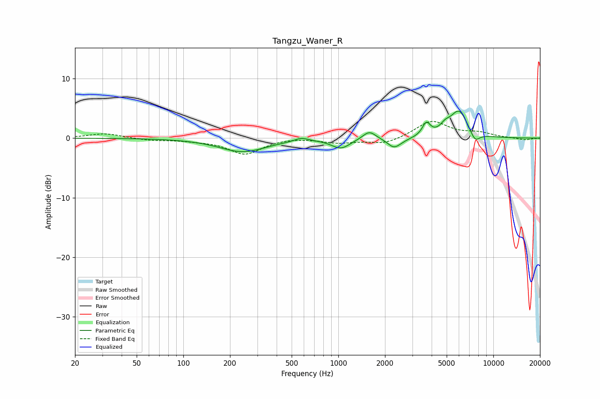

# Tangzu_Waner_R
See [usage instructions](https://github.com/jaakkopasanen/AutoEq#usage) for more options and info.

### Parametric EQs
Apply preamp of -4.6 dB when using parametric equalizer.

|   # | Type    |   Fc (Hz) |    Q |   Gain (dB) |
|-----|---------|-----------|------|-------------|
|   1 | Peaking |       241 | 0.94 |        -2.3 |
|   2 | Peaking |       577 | 3.34 |         0.6 |
|   3 | Peaking |      1038 | 2.33 |        -1.6 |
|   4 | Peaking |      1583 | 3.36 |         1.5 |
|   5 | Peaking |      2279 | 3.47 |        -1.4 |
|   6 | Peaking |      2467 | 2.36 |        -0.4 |
|   7 | Peaking |      3696 | 5.56 |         2.2 |
|   8 | Peaking |      4895 | 4.27 |         1.1 |
|   9 | Peaking |      6008 | 2.42 |         4.5 |
|  10 | Peaking |      7610 | 4.26 |        -1.7 |

### Fixed Band EQs
When using fixed band (also called graphic) equalizer, apply preamp of **-2.9 dB** (if available) and set gains manually with these parameters.

|   # | Type    |   Fc (Hz) |    Q |   Gain (dB) |
|-----|---------|-----------|------|-------------|
|   1 | Peaking |        31 | 1.41 |         0.8 |
|   2 | Peaking |        62 | 1.41 |        -0.4 |
|   3 | Peaking |       125 | 1.41 |        -0.3 |
|   4 | Peaking |       250 | 1.41 |        -2.6 |
|   5 | Peaking |       500 | 1.41 |         0.2 |
|   6 | Peaking |      1000 | 1.41 |        -0.7 |
|   7 | Peaking |      2000 | 1.41 |        -1   |
|   8 | Peaking |      4000 | 1.41 |         2.9 |
|   9 | Peaking |      8000 | 1.41 |         0.8 |
|  10 | Peaking |     16000 | 1.41 |        -0.3 |

### Graphs

