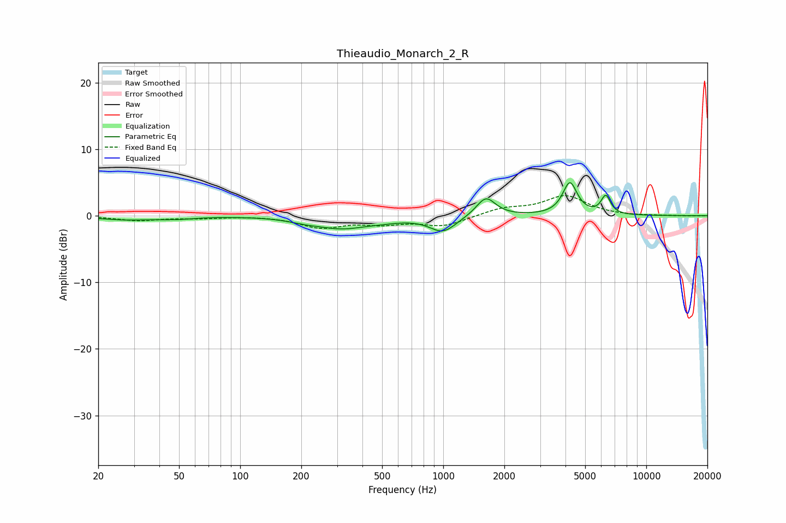

# Thieaudio_Monarch_2_R
See [usage instructions](https://github.com/jaakkopasanen/AutoEq#usage) for more options and info.

### Parametric EQs
Apply preamp of -5.1 dB when using parametric equalizer.

|   # | Type    |   Fc (Hz) |    Q |   Gain (dB) |
|-----|---------|-----------|------|-------------|
|   1 | Peaking |        27 | 1.07 |        -0.6 |
|   2 | Peaking |        48 | 1.54 |        -0.3 |
|   3 | Peaking |       207 | 1.9  |        -0.4 |
|   4 | Peaking |       316 | 1.1  |        -1.7 |
|   5 | Peaking |       510 | 1.52 |        -0.4 |
|   6 | Peaking |       997 | 2.17 |        -2.3 |
|   7 | Peaking |      1584 | 4.3  |        -0.1 |
|   8 | Peaking |      1621 | 3.01 |         3   |
|   9 | Peaking |      4206 | 4    |         4.9 |
|  10 | Peaking |      6317 | 6    |         2.7 |

### Fixed Band EQs
When using fixed band (also called graphic) equalizer, apply preamp of **-3.1 dB** (if available) and set gains manually with these parameters.

|   # | Type    |   Fc (Hz) |    Q |   Gain (dB) |
|-----|---------|-----------|------|-------------|
|   1 | Peaking |        31 | 1.41 |        -0.7 |
|   2 | Peaking |        62 | 1.41 |        -0.3 |
|   3 | Peaking |       125 | 1.41 |         0   |
|   4 | Peaking |       250 | 1.41 |        -1.7 |
|   5 | Peaking |       500 | 1.41 |        -1   |
|   6 | Peaking |      1000 | 1.41 |        -1.5 |
|   7 | Peaking |      2000 | 1.41 |         1   |
|   8 | Peaking |      4000 | 1.41 |         2.9 |
|   9 | Peaking |      8000 | 1.41 |        -0.1 |
|  10 | Peaking |     16000 | 1.41 |        -0   |

### Graphs

