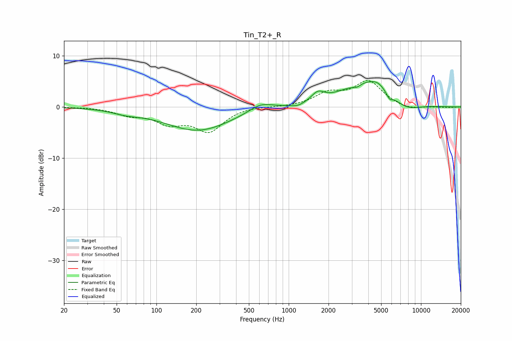

# Tin_T2+_R
See [usage instructions](https://github.com/jaakkopasanen/AutoEq#usage) for more options and info.

### Parametric EQs
Apply preamp of -5.1 dB when using parametric equalizer.

|   # | Type    |   Fc (Hz) |    Q |   Gain (dB) |
|-----|---------|-----------|------|-------------|
|   1 | Peaking |        59 | 1.4  |        -0.7 |
|   2 | Peaking |       205 | 0.57 |        -4.6 |
|   3 | Peaking |       615 | 1.62 |         1.6 |
|   4 | Peaking |      1174 | 2.96 |        -0.6 |
|   5 | Peaking |      1660 | 3.01 |         1.7 |
|   6 | Peaking |      3267 | 4.17 |        -0.7 |
|   7 | Peaking |      3973 | 0.73 |         5.2 |
|   8 | Peaking |      4703 | 3    |         0.8 |
|   9 | Peaking |      5783 | 6    |        -1.1 |
|  10 | Peaking |      7622 | 1.18 |        -2   |

### Fixed Band EQs
When using fixed band (also called graphic) equalizer, apply preamp of **-5.3 dB** (if available) and set gains manually with these parameters.

|   # | Type    |   Fc (Hz) |    Q |   Gain (dB) |
|-----|---------|-----------|------|-------------|
|   1 | Peaking |        31 | 1.41 |         0   |
|   2 | Peaking |        62 | 1.41 |        -1.3 |
|   3 | Peaking |       125 | 1.41 |        -2.8 |
|   4 | Peaking |       250 | 1.41 |        -4.5 |
|   5 | Peaking |       500 | 1.41 |         0.2 |
|   6 | Peaking |      1000 | 1.41 |        -0   |
|   7 | Peaking |      2000 | 1.41 |         2.4 |
|   8 | Peaking |      4000 | 1.41 |         4.9 |
|   9 | Peaking |      8000 | 1.41 |        -0.7 |
|  10 | Peaking |     16000 | 1.41 |        -0.1 |

### Graphs

