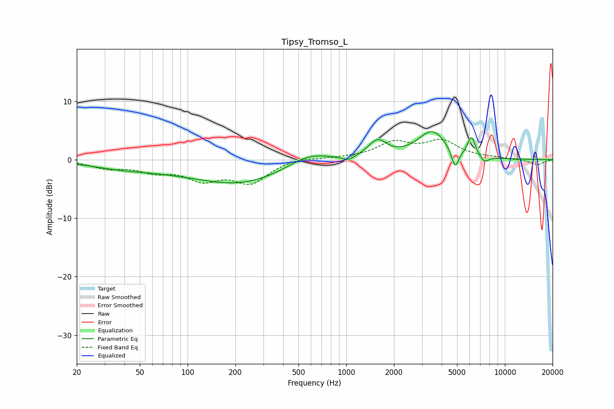

# Tipsy_Tromso_L
See [usage instructions](https://github.com/jaakkopasanen/AutoEq#usage) for more options and info.

### Parametric EQs
Apply preamp of -4.9 dB when using parametric equalizer.

|   # | Type    |   Fc (Hz) |    Q |   Gain (dB) |
|-----|---------|-----------|------|-------------|
|   1 | Peaking |        40 | 0.67 |        -1.2 |
|   2 | Peaking |        78 | 1.26 |        -0.2 |
|   3 | Peaking |       211 | 0.46 |        -4.1 |
|   4 | Peaking |       580 | 1.02 |         2.2 |
|   5 | Peaking |      1037 | 3.67 |        -0.8 |
|   6 | Peaking |      1573 | 2.41 |         3   |
|   7 | Peaking |      3482 | 1.53 |         4.8 |
|   8 | Peaking |      4857 | 5.91 |        -3.4 |
|   9 | Peaking |      6162 | 5.73 |         3.3 |
|  10 | Peaking |      7432 | 5.01 |        -1.1 |

### Fixed Band EQs
When using fixed band (also called graphic) equalizer, apply preamp of **-3.6 dB** (if available) and set gains manually with these parameters.

|   # | Type    |   Fc (Hz) |    Q |   Gain (dB) |
|-----|---------|-----------|------|-------------|
|   1 | Peaking |        31 | 1.41 |        -1.3 |
|   2 | Peaking |        62 | 1.41 |        -1.7 |
|   3 | Peaking |       125 | 1.41 |        -3   |
|   4 | Peaking |       250 | 1.41 |        -3.7 |
|   5 | Peaking |       500 | 1.41 |         0.5 |
|   6 | Peaking |      1000 | 1.41 |         0.2 |
|   7 | Peaking |      2000 | 1.41 |         2.7 |
|   8 | Peaking |      4000 | 1.41 |         3   |
|   9 | Peaking |      8000 | 1.41 |         0.3 |
|  10 | Peaking |     16000 | 1.41 |        -0.9 |

### Graphs

