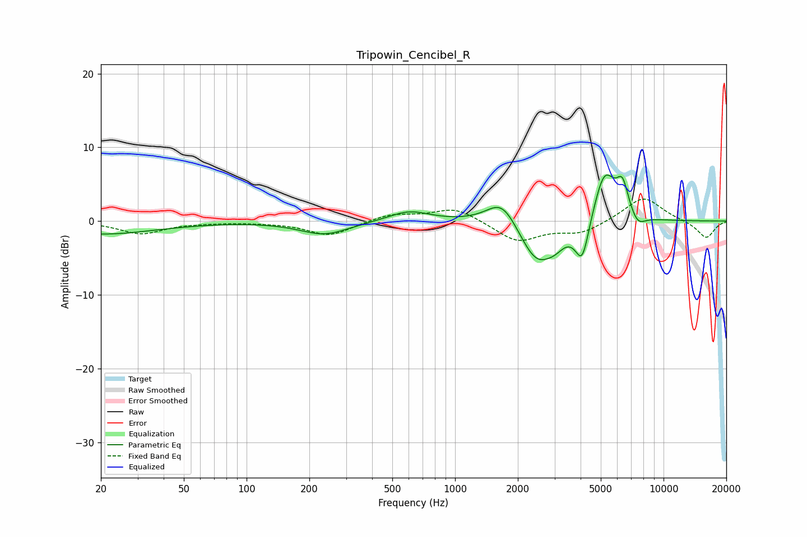

# Tripowin_Cencibel_R
See [usage instructions](https://github.com/jaakkopasanen/AutoEq#usage) for more options and info.

### Parametric EQs
Apply preamp of -6.3 dB when using parametric equalizer.

|   # | Type    |   Fc (Hz) |    Q |   Gain (dB) |
|-----|---------|-----------|------|-------------|
|   1 | Peaking |        20 | 0.53 |        -1.8 |
|   2 | Peaking |       236 | 1.2  |        -1.8 |
|   3 | Peaking |       603 | 1.45 |         1.5 |
|   4 | Peaking |      1685 | 1.88 |         3.8 |
|   5 | Peaking |      2468 | 1.63 |        -6   |
|   6 | Peaking |      3036 | 3.11 |        -1.2 |
|   7 | Peaking |      4075 | 4.1  |        -5.7 |
|   8 | Peaking |      5206 | 2.56 |         7.1 |
|   9 | Peaking |      6359 | 4.73 |         4   |
|  10 | Peaking |      7511 | 3.75 |        -1.6 |

### Fixed Band EQs
When using fixed band (also called graphic) equalizer, apply preamp of **-3.1 dB** (if available) and set gains manually with these parameters.

|   # | Type    |   Fc (Hz) |    Q |   Gain (dB) |
|-----|---------|-----------|------|-------------|
|   1 | Peaking |        31 | 1.41 |        -1.7 |
|   2 | Peaking |        62 | 1.41 |        -0.1 |
|   3 | Peaking |       125 | 1.41 |        -0.1 |
|   4 | Peaking |       250 | 1.41 |        -2   |
|   5 | Peaking |       500 | 1.41 |         1   |
|   6 | Peaking |      1000 | 1.41 |         1.8 |
|   7 | Peaking |      2000 | 1.41 |        -2.8 |
|   8 | Peaking |      4000 | 1.41 |        -1.6 |
|   9 | Peaking |      8000 | 1.41 |         3.4 |
|  10 | Peaking |     16000 | 1.41 |        -2.4 |

### Graphs

