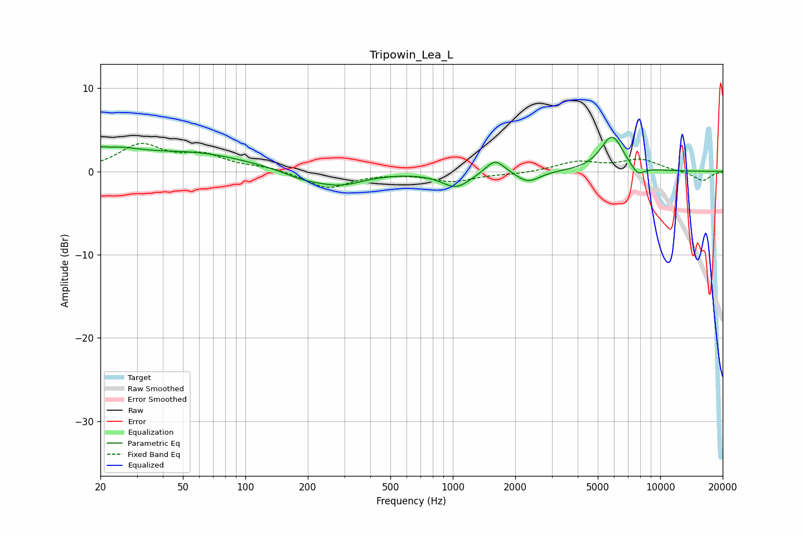

# Tripowin_Lea_L
See [usage instructions](https://github.com/jaakkopasanen/AutoEq#usage) for more options and info.

### Parametric EQs
Apply preamp of -4.2 dB when using parametric equalizer.

|   # | Type    |   Fc (Hz) |    Q |   Gain (dB) |
|-----|---------|-----------|------|-------------|
|   1 | Peaking |        20 | 6    |         0.4 |
|   2 | Peaking |        23 | 1.08 |         1.9 |
|   3 | Peaking |        57 | 0.54 |         2.1 |
|   4 | Peaking |       188 | 1.47 |        -0.8 |
|   5 | Peaking |       284 | 1.18 |        -1.6 |
|   6 | Peaking |      1036 | 2.04 |        -1.9 |
|   7 | Peaking |      1599 | 3.09 |         1.8 |
|   8 | Peaking |      2304 | 2.54 |        -1.3 |
|   9 | Peaking |      5851 | 2.5  |         4.3 |
|  10 | Peaking |      7775 | 4.02 |        -1.2 |

### Fixed Band EQs
When using fixed band (also called graphic) equalizer, apply preamp of **-3.5 dB** (if available) and set gains manually with these parameters.

|   # | Type    |   Fc (Hz) |    Q |   Gain (dB) |
|-----|---------|-----------|------|-------------|
|   1 | Peaking |        31 | 1.41 |         3   |
|   2 | Peaking |        62 | 1.41 |         1.7 |
|   3 | Peaking |       125 | 1.41 |         0.5 |
|   4 | Peaking |       250 | 1.41 |        -2   |
|   5 | Peaking |       500 | 1.41 |        -0.1 |
|   6 | Peaking |      1000 | 1.41 |        -1.1 |
|   7 | Peaking |      2000 | 1.41 |        -0.3 |
|   8 | Peaking |      4000 | 1.41 |         1.1 |
|   9 | Peaking |      8000 | 1.41 |         1.4 |
|  10 | Peaking |     16000 | 1.41 |        -1.2 |

### Graphs

