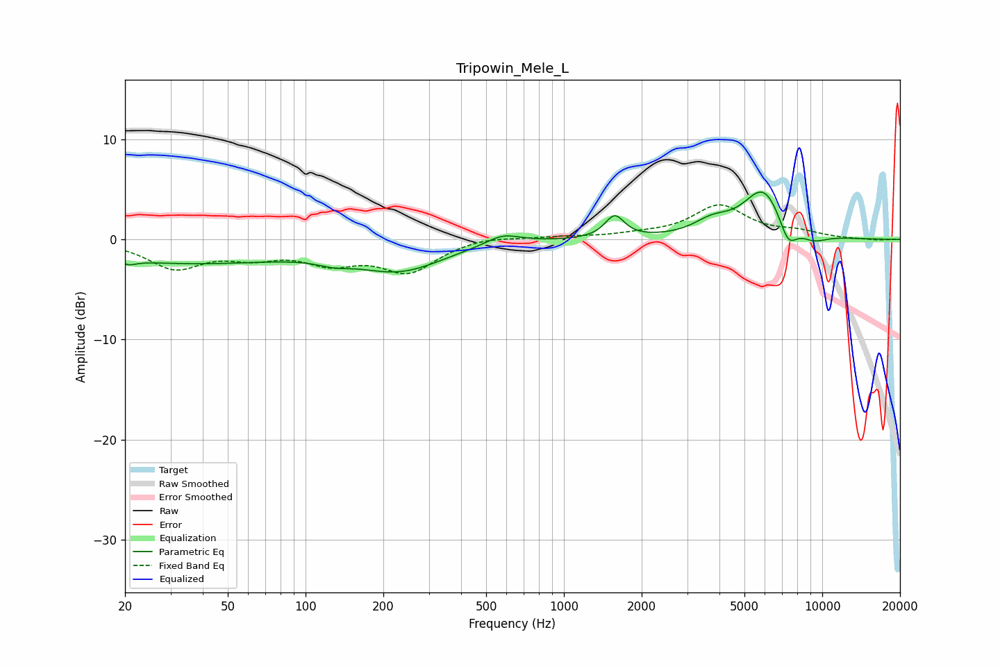

# Tripowin_Mele_L
See [usage instructions](https://github.com/jaakkopasanen/AutoEq#usage) for more options and info.

### Parametric EQs
Apply preamp of -4.8 dB when using parametric equalizer.

|   # | Type    |   Fc (Hz) |    Q |   Gain (dB) |
|-----|---------|-----------|------|-------------|
|   1 | Peaking |        21 | 4.94 |        -0.4 |
|   2 | Peaking |        34 | 0.33 |        -2.3 |
|   3 | Peaking |       128 | 2.24 |        -0.5 |
|   4 | Peaking |       233 | 0.84 |        -2.8 |
|   5 | Peaking |       581 | 2.11 |         1   |
|   6 | Peaking |      1573 | 3.8  |         2.2 |
|   7 | Peaking |      3750 | 1.96 |         1.4 |
|   8 | Peaking |      5932 | 1.74 |         5   |
|   9 | Peaking |      7368 | 3.82 |        -2.5 |
|  10 | Peaking |      9272 | 2.46 |        -0.8 |

### Fixed Band EQs
When using fixed band (also called graphic) equalizer, apply preamp of **-3.6 dB** (if available) and set gains manually with these parameters.

|   # | Type    |   Fc (Hz) |    Q |   Gain (dB) |
|-----|---------|-----------|------|-------------|
|   1 | Peaking |        31 | 1.41 |        -2.7 |
|   2 | Peaking |        62 | 1.41 |        -1.4 |
|   3 | Peaking |       125 | 1.41 |        -2   |
|   4 | Peaking |       250 | 1.41 |        -3.1 |
|   5 | Peaking |       500 | 1.41 |         0.4 |
|   6 | Peaking |      1000 | 1.41 |         0.2 |
|   7 | Peaking |      2000 | 1.41 |         0.3 |
|   8 | Peaking |      4000 | 1.41 |         3.3 |
|   9 | Peaking |      8000 | 1.41 |         0.6 |
|  10 | Peaking |     16000 | 1.41 |        -0.1 |

### Graphs

