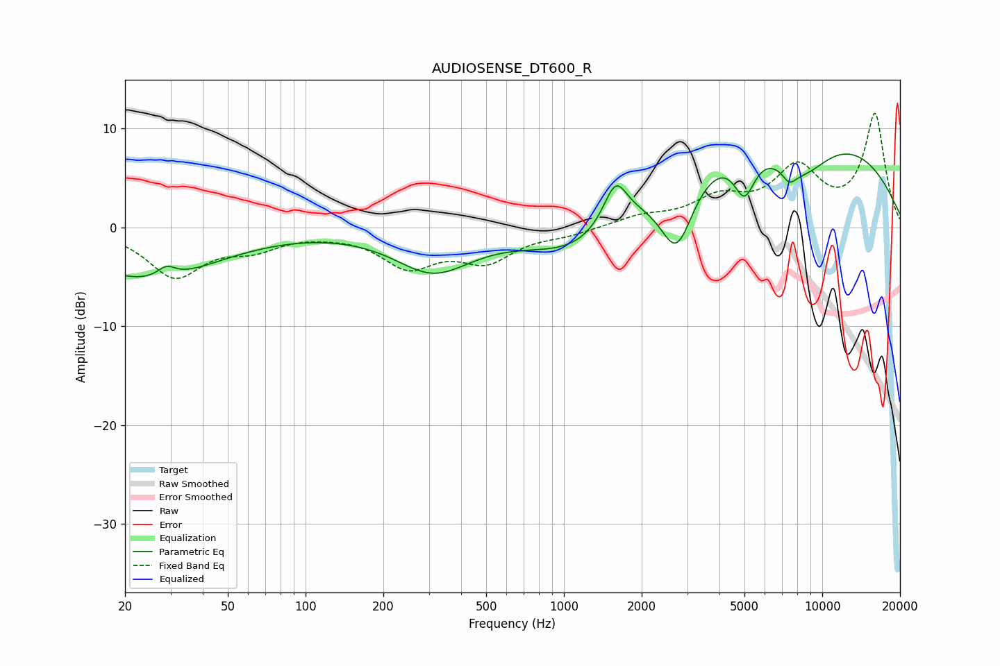

# AUDIOSENSE_DT600_R
See [usage instructions](https://github.com/jaakkopasanen/AutoEq#usage) for more options and info.

### Parametric EQs
Apply preamp of -7.5 dB when using parametric equalizer.

|   # | Type    |   Fc (Hz) |    Q |   Gain (dB) |
|-----|---------|-----------|------|-------------|
|   1 | Peaking |        24 | 0.54 |        -5.2 |
|   2 | Peaking |        29 | 4.08 |         1.1 |
|   3 | Peaking |       312 | 0.95 |        -4.2 |
|   4 | Peaking |      1152 | 0.71 |        -4.4 |
|   5 | Peaking |      1584 | 3.07 |         4.3 |
|   6 | Peaking |      2732 | 2.05 |        -7.8 |
|   7 | Peaking |      5003 | 3.37 |        -4.4 |
|   8 | Peaking |      7083 | 0.24 |        11.3 |
|   9 | Peaking |      7447 | 4.76 |        -1.3 |
|  10 | Peaking |      8324 | 1.07 |        -4.9 |

### Fixed Band EQs
When using fixed band (also called graphic) equalizer, apply preamp of **-11.6 dB** (if available) and set gains manually with these parameters.

|   # | Type    |   Fc (Hz) |    Q |   Gain (dB) |
|-----|---------|-----------|------|-------------|
|   1 | Peaking |        31 | 1.41 |        -4.8 |
|   2 | Peaking |        62 | 1.41 |        -1.7 |
|   3 | Peaking |       125 | 1.41 |        -0.2 |
|   4 | Peaking |       250 | 1.41 |        -3.7 |
|   5 | Peaking |       500 | 1.41 |        -3.1 |
|   6 | Peaking |      1000 | 1.41 |        -0.6 |
|   7 | Peaking |      2000 | 1.41 |         1   |
|   8 | Peaking |      4000 | 1.41 |         2.6 |
|   9 | Peaking |      8000 | 1.41 |         5.5 |
|  10 | Peaking |     16000 | 1.41 |        11.3 |

### Graphs

