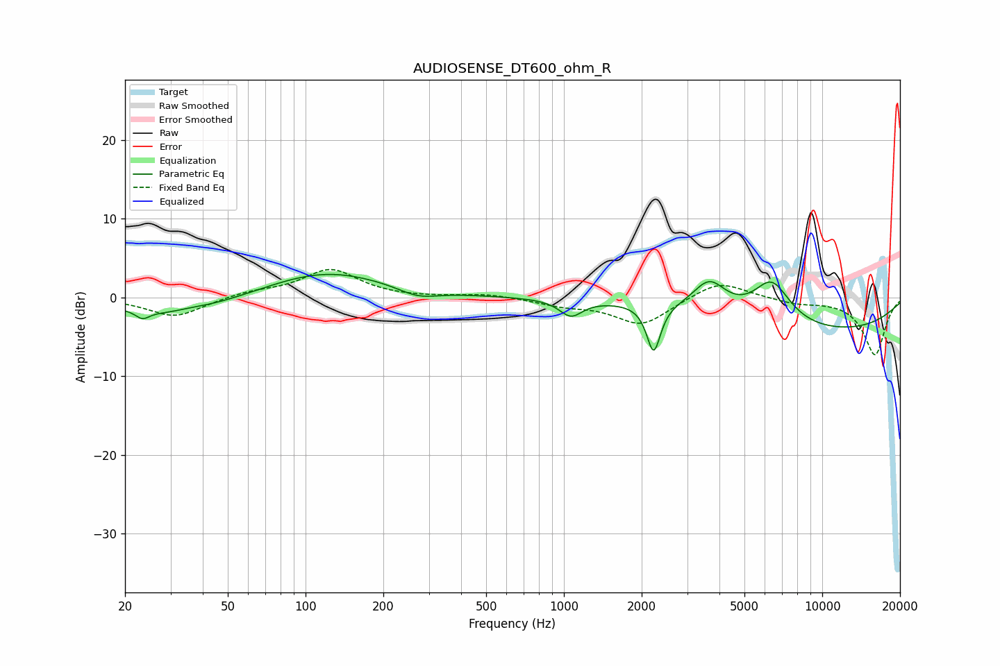

# AUDIOSENSE_DT600_ohm_R
See [usage instructions](https://github.com/jaakkopasanen/AutoEq#usage) for more options and info.

### Parametric EQs
Apply preamp of -3.0 dB when using parametric equalizer.

|   # | Type    |   Fc (Hz) |    Q |   Gain (dB) |
|-----|---------|-----------|------|-------------|
|   1 | Peaking |        23 | 5.67 |        -1   |
|   2 | Peaking |        32 | 0.71 |        -2.7 |
|   3 | Peaking |        36 | 1.61 |         0.6 |
|   4 | Peaking |       120 | 0.6  |         3.4 |
|   5 | Peaking |       273 | 1.85 |        -1.2 |
|   6 | Peaking |      1065 | 3.21 |        -2.1 |
|   7 | Peaking |      2226 | 5.32 |        -6.2 |
|   8 | Peaking |      3657 | 2.21 |         3.9 |
|   9 | Peaking |      6376 | 1.9  |         5.3 |
|  10 | Peaking |     10000 | 0.3  |        -4.3 |

### Fixed Band EQs
When using fixed band (also called graphic) equalizer, apply preamp of **-3.7 dB** (if available) and set gains manually with these parameters.

|   # | Type    |   Fc (Hz) |    Q |   Gain (dB) |
|-----|---------|-----------|------|-------------|
|   1 | Peaking |        31 | 1.41 |        -2.5 |
|   2 | Peaking |        62 | 1.41 |         0.7 |
|   3 | Peaking |       125 | 1.41 |         3.5 |
|   4 | Peaking |       250 | 1.41 |        -0.1 |
|   5 | Peaking |       500 | 1.41 |         0.5 |
|   6 | Peaking |      1000 | 1.41 |        -0.9 |
|   7 | Peaking |      2000 | 1.41 |        -3.5 |
|   8 | Peaking |      4000 | 1.41 |         2.3 |
|   9 | Peaking |      8000 | 1.41 |        -0.7 |
|  10 | Peaking |     16000 | 1.41 |        -7.3 |

### Graphs

