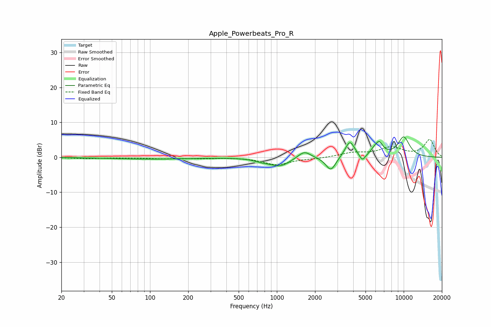

# Apple_Powerbeats_Pro_R
See [usage instructions](https://github.com/jaakkopasanen/AutoEq#usage) for more options and info.

### Parametric EQs
Apply preamp of -5.9 dB when using parametric equalizer.

|   # | Type    |   Fc (Hz) |    Q |   Gain (dB) |
|-----|---------|-----------|------|-------------|
|   1 | Peaking |       100 | 0.45 |        -0.5 |
|   2 | Peaking |       765 | 2.32 |        -0.7 |
|   3 | Peaking |      1058 | 1.83 |        -2.4 |
|   4 | Peaking |      1646 | 2.82 |         2.2 |
|   5 | Peaking |      2665 | 3.56 |        -4   |
|   6 | Peaking |      3761 | 3.77 |         4.7 |
|   7 | Peaking |      4717 | 5.92 |        -2.1 |
|   8 | Peaking |      5765 | 5.65 |         0.8 |
|   9 | Peaking |      6383 | 4.29 |         3.6 |
|  10 | Peaking |     10000 | 2.54 |         5.7 |

### Fixed Band EQs
When using fixed band (also called graphic) equalizer, apply preamp of **-5.2 dB** (if available) and set gains manually with these parameters.

|   # | Type    |   Fc (Hz) |    Q |   Gain (dB) |
|-----|---------|-----------|------|-------------|
|   1 | Peaking |        31 | 1.41 |        -0.3 |
|   2 | Peaking |        62 | 1.41 |        -0.1 |
|   3 | Peaking |       125 | 1.41 |        -0.4 |
|   4 | Peaking |       250 | 1.41 |        -0.3 |
|   5 | Peaking |       500 | 1.41 |        -0   |
|   6 | Peaking |      1000 | 1.41 |        -2.1 |
|   7 | Peaking |      2000 | 1.41 |        -0.3 |
|   8 | Peaking |      4000 | 1.41 |         1.2 |
|   9 | Peaking |      8000 | 1.41 |         2.7 |
|  10 | Peaking |     16000 | 1.41 |         5   |

### Graphs

