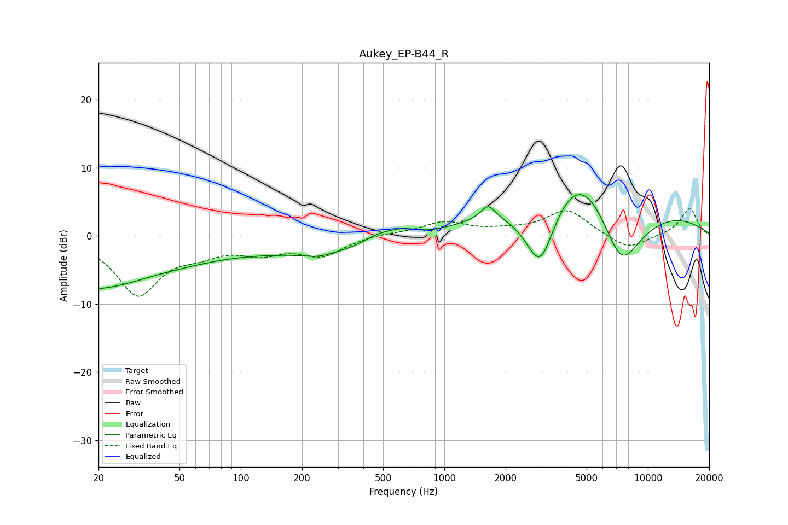

# Aukey_EP-B44_R
See [usage instructions](https://github.com/jaakkopasanen/AutoEq#usage) for more options and info.

### Parametric EQs
Apply preamp of -6.1 dB when using parametric equalizer.

|   # | Type    |   Fc (Hz) |    Q |   Gain (dB) |
|-----|---------|-----------|------|-------------|
|   1 | Peaking |        20 | 0.34 |        -8.5 |
|   2 | Peaking |        35 | 0.66 |         1.3 |
|   3 | Peaking |       239 | 2.56 |        -0.5 |
|   4 | Peaking |       477 | 1.54 |         1.9 |
|   5 | Peaking |       634 | 1.97 |         1.3 |
|   6 | Peaking |       770 | 0.2  |        -3.9 |
|   7 | Peaking |      1643 | 4.16 |         2.1 |
|   8 | Peaking |      2954 | 1.58 |       -12.8 |
|   9 | Peaking |      4628 | 0.4  |        20   |
|  10 | Peaking |      7356 | 0.9  |       -16.3 |

### Fixed Band EQs
When using fixed band (also called graphic) equalizer, apply preamp of **-4.0 dB** (if available) and set gains manually with these parameters.

|   # | Type    |   Fc (Hz) |    Q |   Gain (dB) |
|-----|---------|-----------|------|-------------|
|   1 | Peaking |        31 | 1.41 |        -8.4 |
|   2 | Peaking |        62 | 1.41 |        -1.8 |
|   3 | Peaking |       125 | 1.41 |        -2.1 |
|   4 | Peaking |       250 | 1.41 |        -2.7 |
|   5 | Peaking |       500 | 1.41 |         0.4 |
|   6 | Peaking |      1000 | 1.41 |         1.9 |
|   7 | Peaking |      2000 | 1.41 |         0.5 |
|   8 | Peaking |      4000 | 1.41 |         3.8 |
|   9 | Peaking |      8000 | 1.41 |        -2.2 |
|  10 | Peaking |     16000 | 1.41 |         4   |

### Graphs

