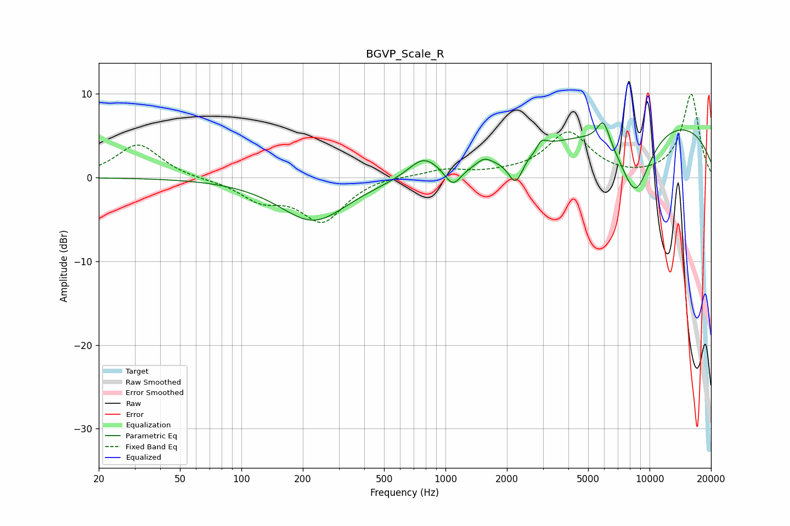

# BGVP_Scale_R
See [usage instructions](https://github.com/jaakkopasanen/AutoEq#usage) for more options and info.

### Parametric EQs
Apply preamp of -6.6 dB when using parametric equalizer.

|   # | Type    |   Fc (Hz) |    Q |   Gain (dB) |
|-----|---------|-----------|------|-------------|
|   1 | Peaking |       226 | 0.85 |        -5.2 |
|   2 | Peaking |       781 | 1.9  |         2.4 |
|   3 | Peaking |      1087 | 3.52 |        -2.2 |
|   4 | Peaking |      1548 | 3.83 |         0.9 |
|   5 | Peaking |      2208 | 3.91 |        -3.4 |
|   6 | Peaking |      2817 | 5.15 |        -3   |
|   7 | Peaking |      2864 | 4.8  |         3.8 |
|   8 | Peaking |      5939 | 4.5  |         2.9 |
|   9 | Peaking |      8505 | 1.59 |        -8.6 |
|  10 | Peaking |     10000 | 0.23 |         7.3 |

### Fixed Band EQs
When using fixed band (also called graphic) equalizer, apply preamp of **-10.1 dB** (if available) and set gains manually with these parameters.

|   # | Type    |   Fc (Hz) |    Q |   Gain (dB) |
|-----|---------|-----------|------|-------------|
|   1 | Peaking |        31 | 1.41 |         4   |
|   2 | Peaking |        62 | 1.41 |        -0.2 |
|   3 | Peaking |       125 | 1.41 |        -2.4 |
|   4 | Peaking |       250 | 1.41 |        -5   |
|   5 | Peaking |       500 | 1.41 |         0.3 |
|   6 | Peaking |      1000 | 1.41 |         0.9 |
|   7 | Peaking |      2000 | 1.41 |         0.3 |
|   8 | Peaking |      4000 | 1.41 |         5.3 |
|   9 | Peaking |      8000 | 1.41 |        -0.2 |
|  10 | Peaking |     16000 | 1.41 |        10   |

### Graphs

