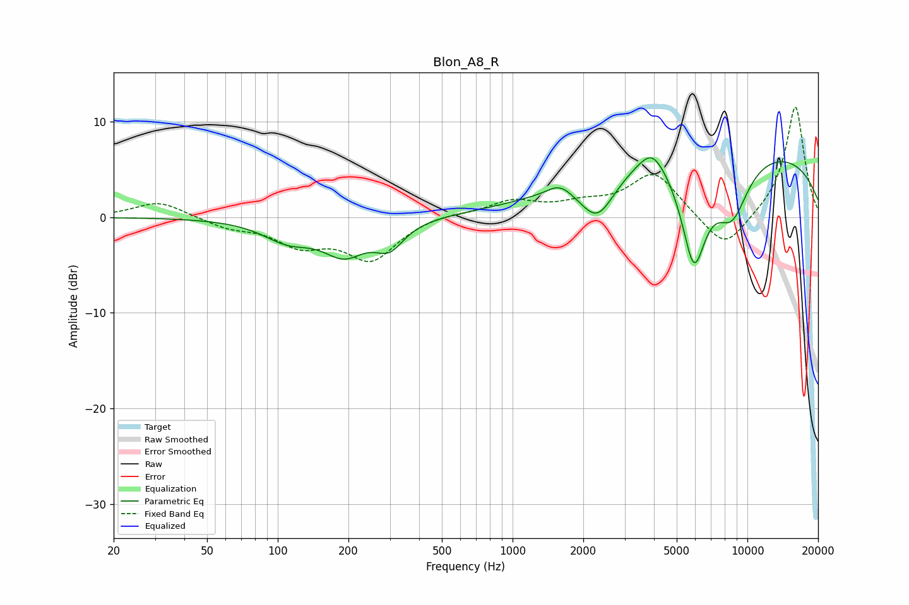

# Blon_A8_R
See [usage instructions](https://github.com/jaakkopasanen/AutoEq#usage) for more options and info.

### Parametric EQs
Apply preamp of -6.3 dB when using parametric equalizer.

|   # | Type    |   Fc (Hz) |    Q |   Gain (dB) |
|-----|---------|-----------|------|-------------|
|   1 | Peaking |       110 | 1.31 |        -2.1 |
|   2 | Peaking |       192 | 1.55 |        -3.4 |
|   3 | Peaking |       299 | 2.28 |        -2.6 |
|   4 | Peaking |      1585 | 2.76 |         1.1 |
|   5 | Peaking |      2293 | 1.89 |        -4.5 |
|   6 | Peaking |      3896 | 4.93 |         0.2 |
|   7 | Peaking |      3948 | 2.02 |         2.6 |
|   8 | Peaking |      5918 | 2.45 |       -10.7 |
|   9 | Peaking |      8321 | 0.18 |         7.5 |
|  10 | Peaking |      8590 | 1.74 |        -5.9 |

### Fixed Band EQs
When using fixed band (also called graphic) equalizer, apply preamp of **-11.6 dB** (if available) and set gains manually with these parameters.

|   # | Type    |   Fc (Hz) |    Q |   Gain (dB) |
|-----|---------|-----------|------|-------------|
|   1 | Peaking |        31 | 1.41 |         1.7 |
|   2 | Peaking |        62 | 1.41 |        -1   |
|   3 | Peaking |       125 | 1.41 |        -2.6 |
|   4 | Peaking |       250 | 1.41 |        -4.3 |
|   5 | Peaking |       500 | 1.41 |         0.4 |
|   6 | Peaking |      1000 | 1.41 |         1.6 |
|   7 | Peaking |      2000 | 1.41 |         1.1 |
|   8 | Peaking |      4000 | 1.41 |         4.6 |
|   9 | Peaking |      8000 | 1.41 |        -3.7 |
|  10 | Peaking |     16000 | 1.41 |        11.7 |

### Graphs

