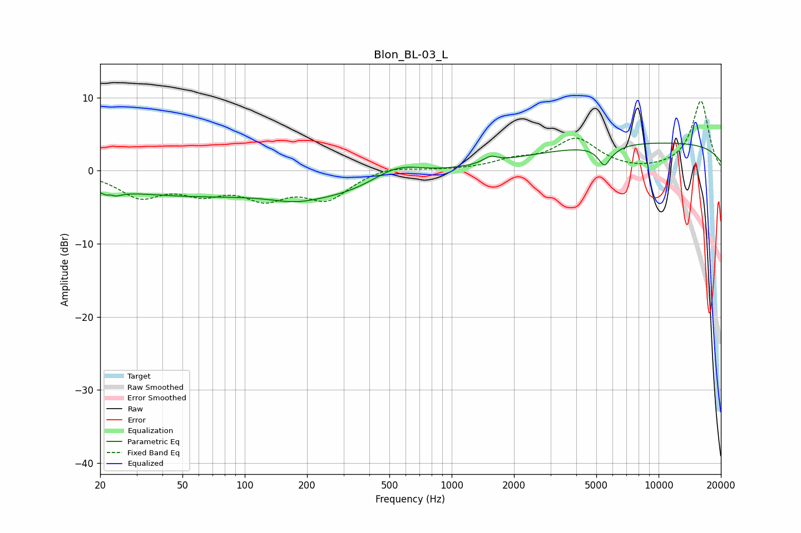

# Blon_BL-03_L
See [usage instructions](https://github.com/jaakkopasanen/AutoEq#usage) for more options and info.

### Parametric EQs
Apply preamp of -3.9 dB when using parametric equalizer.

|   # | Type    |   Fc (Hz) |    Q |   Gain (dB) |
|-----|---------|-----------|------|-------------|
|   1 | Peaking |        22 | 4.59 |        -3.1 |
|   2 | Peaking |        22 | 5.97 |         2.3 |
|   3 | Peaking |        48 | 0.32 |        -3.1 |
|   4 | Peaking |       175 | 1.25 |        -0.9 |
|   5 | Peaking |       320 | 0.47 |        -3.1 |
|   6 | Peaking |       540 | 1.09 |         2.7 |
|   7 | Peaking |      1542 | 4.22 |         0.8 |
|   8 | Peaking |      5584 | 4.37 |        -4.1 |
|   9 | Peaking |      5719 | 6    |         1.6 |
|  10 | Peaking |      9680 | 0.18 |         3.8 |

### Fixed Band EQs
When using fixed band (also called graphic) equalizer, apply preamp of **-9.6 dB** (if available) and set gains manually with these parameters.

|   # | Type    |   Fc (Hz) |    Q |   Gain (dB) |
|-----|---------|-----------|------|-------------|
|   1 | Peaking |        31 | 1.41 |        -3.3 |
|   2 | Peaking |        62 | 1.41 |        -2.5 |
|   3 | Peaking |       125 | 1.41 |        -3.2 |
|   4 | Peaking |       250 | 1.41 |        -3.6 |
|   5 | Peaking |       500 | 1.41 |         0.8 |
|   6 | Peaking |      1000 | 1.41 |         0   |
|   7 | Peaking |      2000 | 1.41 |         1.2 |
|   8 | Peaking |      4000 | 1.41 |         4.2 |
|   9 | Peaking |      8000 | 1.41 |        -0.2 |
|  10 | Peaking |     16000 | 1.41 |         9.6 |

### Graphs

