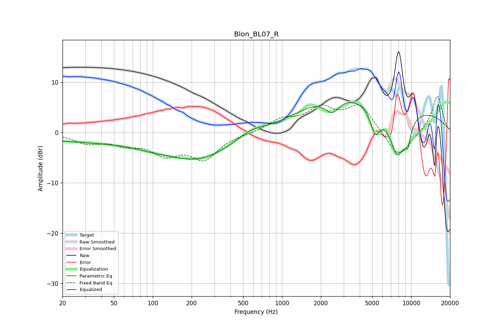

# Blon_BL07_R
See [usage instructions](https://github.com/jaakkopasanen/AutoEq#usage) for more options and info.

### Parametric EQs
Apply preamp of -6.1 dB when using parametric equalizer.

|   # | Type    |   Fc (Hz) |    Q |   Gain (dB) |
|-----|---------|-----------|------|-------------|
|   1 | Peaking |        36 | 0.25 |        -1.7 |
|   2 | Peaking |        96 | 1.56 |        -0.3 |
|   3 | Peaking |       225 | 0.54 |        -5   |
|   4 | Peaking |       574 | 1.4  |         1.4 |
|   5 | Peaking |      2379 | 0.54 |         3.6 |
|   6 | Peaking |      2453 | 2.49 |        -3.1 |
|   7 | Peaking |      5264 | 3.74 |        -4.9 |
|   8 | Peaking |      6813 | 0.23 |         5.4 |
|   9 | Peaking |      7869 | 1.96 |        -9.8 |
|  10 | Peaking |      9439 | 5.42 |        -3.5 |

### Fixed Band EQs
When using fixed band (also called graphic) equalizer, apply preamp of **-7.3 dB** (if available) and set gains manually with these parameters.

|   # | Type    |   Fc (Hz) |    Q |   Gain (dB) |
|-----|---------|-----------|------|-------------|
|   1 | Peaking |        31 | 1.41 |        -1.9 |
|   2 | Peaking |        62 | 1.41 |        -1.9 |
|   3 | Peaking |       125 | 1.41 |        -3.8 |
|   4 | Peaking |       250 | 1.41 |        -4.9 |
|   5 | Peaking |       500 | 1.41 |        -0.2 |
|   6 | Peaking |      1000 | 1.41 |         2.3 |
|   7 | Peaking |      2000 | 1.41 |         4.3 |
|   8 | Peaking |      4000 | 1.41 |         5.3 |
|   9 | Peaking |      8000 | 1.41 |        -5.3 |
|  10 | Peaking |     16000 | 1.41 |         7.4 |

### Graphs

