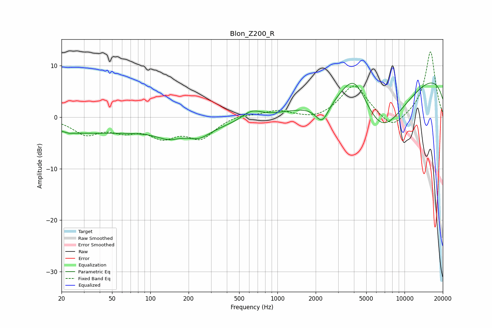

# Blon_Z200_R
See [usage instructions](https://github.com/jaakkopasanen/AutoEq#usage) for more options and info.

### Parametric EQs
Apply preamp of -6.8 dB when using parametric equalizer.

|   # | Type    |   Fc (Hz) |    Q |   Gain (dB) |
|-----|---------|-----------|------|-------------|
|   1 | Peaking |        23 | 3.31 |        -0.4 |
|   2 | Peaking |        24 | 0.59 |        -1   |
|   3 | Peaking |        94 | 0.19 |        -2.7 |
|   4 | Peaking |       140 | 1.59 |        -1.4 |
|   5 | Peaking |       242 | 1.68 |        -1.7 |
|   6 | Peaking |       625 | 1.85 |         1.8 |
|   7 | Peaking |      2251 | 2.63 |        -3.9 |
|   8 | Peaking |      4026 | 1.28 |         7.6 |
|   9 | Peaking |      6523 | 0.57 |       -13.6 |
|  10 | Peaking |     10000 | 0.18 |        10.7 |

### Fixed Band EQs
When using fixed band (also called graphic) equalizer, apply preamp of **-12.8 dB** (if available) and set gains manually with these parameters.

|   # | Type    |   Fc (Hz) |    Q |   Gain (dB) |
|-----|---------|-----------|------|-------------|
|   1 | Peaking |        31 | 1.41 |        -3.1 |
|   2 | Peaking |        62 | 1.41 |        -2.1 |
|   3 | Peaking |       125 | 1.41 |        -3.3 |
|   4 | Peaking |       250 | 1.41 |        -3.8 |
|   5 | Peaking |       500 | 1.41 |         0.6 |
|   6 | Peaking |      1000 | 1.41 |         1.3 |
|   7 | Peaking |      2000 | 1.41 |        -0.7 |
|   8 | Peaking |      4000 | 1.41 |         6.4 |
|   9 | Peaking |      8000 | 1.41 |        -2.8 |
|  10 | Peaking |     16000 | 1.41 |        12.9 |

### Graphs

