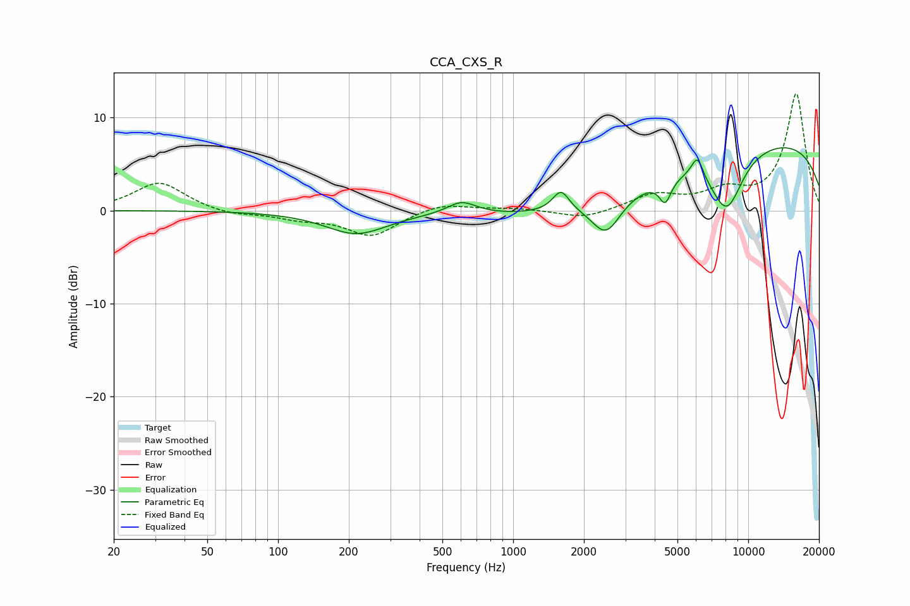

# CCA_CXS_R
See [usage instructions](https://github.com/jaakkopasanen/AutoEq#usage) for more options and info.

### Parametric EQs
Apply preamp of -6.8 dB when using parametric equalizer.

|   # | Type    |   Fc (Hz) |    Q |   Gain (dB) |
|-----|---------|-----------|------|-------------|
|   1 | Peaking |       215 | 1.08 |        -2.5 |
|   2 | Peaking |       604 | 2.3  |         1.4 |
|   3 | Peaking |      1598 | 4.05 |         2.2 |
|   4 | Peaking |      2485 | 2.25 |        -3.9 |
|   5 | Peaking |      2796 | 0.35 |        -3   |
|   6 | Peaking |      4434 | 5.66 |        -2.4 |
|   7 | Peaking |      5978 | 3.97 |         0.7 |
|   8 | Peaking |      6097 | 6    |         1.8 |
|   9 | Peaking |      8096 | 1.89 |        -6.1 |
|  10 | Peaking |      9765 | 0.18 |         8.1 |

### Fixed Band EQs
When using fixed band (also called graphic) equalizer, apply preamp of **-12.6 dB** (if available) and set gains manually with these parameters.

|   # | Type    |   Fc (Hz) |    Q |   Gain (dB) |
|-----|---------|-----------|------|-------------|
|   1 | Peaking |        31 | 1.41 |         3.1 |
|   2 | Peaking |        62 | 1.41 |        -0.5 |
|   3 | Peaking |       125 | 1.41 |        -0.8 |
|   4 | Peaking |       250 | 1.41 |        -2.7 |
|   5 | Peaking |       500 | 1.41 |         0.9 |
|   6 | Peaking |      1000 | 1.41 |         0.3 |
|   7 | Peaking |      2000 | 1.41 |        -0.9 |
|   8 | Peaking |      4000 | 1.41 |         1.6 |
|   9 | Peaking |      8000 | 1.41 |         1.8 |
|  10 | Peaking |     16000 | 1.41 |        12.5 |

### Graphs

