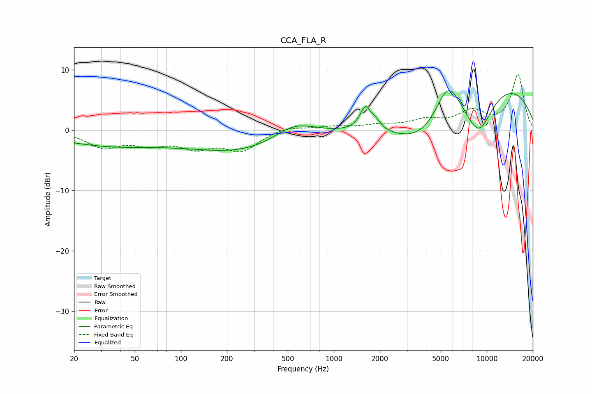

# CCA_FLA_R
See [usage instructions](https://github.com/jaakkopasanen/AutoEq#usage) for more options and info.

### Parametric EQs
Apply preamp of -6.7 dB when using parametric equalizer.

|   # | Type    |   Fc (Hz) |    Q |   Gain (dB) |
|-----|---------|-----------|------|-------------|
|   1 | Peaking |        28 | 0.46 |        -1.9 |
|   2 | Peaking |        61 | 0.49 |        -0.8 |
|   3 | Peaking |       260 | 0.42 |        -3.5 |
|   4 | Peaking |       552 | 1    |         2.9 |
|   5 | Peaking |      1609 | 4.05 |         3.8 |
|   6 | Peaking |      1882 | 4.26 |         1.2 |
|   7 | Peaking |      3801 | 0.7  |        -6.4 |
|   8 | Peaking |      5575 | 1.68 |         6.3 |
|   9 | Peaking |      8842 | 1.29 |        -7.7 |
|  10 | Peaking |     10000 | 0.26 |         8.7 |

### Fixed Band EQs
When using fixed band (also called graphic) equalizer, apply preamp of **-9.3 dB** (if available) and set gains manually with these parameters.

|   # | Type    |   Fc (Hz) |    Q |   Gain (dB) |
|-----|---------|-----------|------|-------------|
|   1 | Peaking |        31 | 1.41 |        -2.6 |
|   2 | Peaking |        62 | 1.41 |        -1.9 |
|   3 | Peaking |       125 | 1.41 |        -2.5 |
|   4 | Peaking |       250 | 1.41 |        -3.2 |
|   5 | Peaking |       500 | 1.41 |         0.7 |
|   6 | Peaking |      1000 | 1.41 |         0.5 |
|   7 | Peaking |      2000 | 1.41 |         0.7 |
|   8 | Peaking |      4000 | 1.41 |         1.5 |
|   9 | Peaking |      8000 | 1.41 |         2.9 |
|  10 | Peaking |     16000 | 1.41 |         9.1 |

### Graphs

