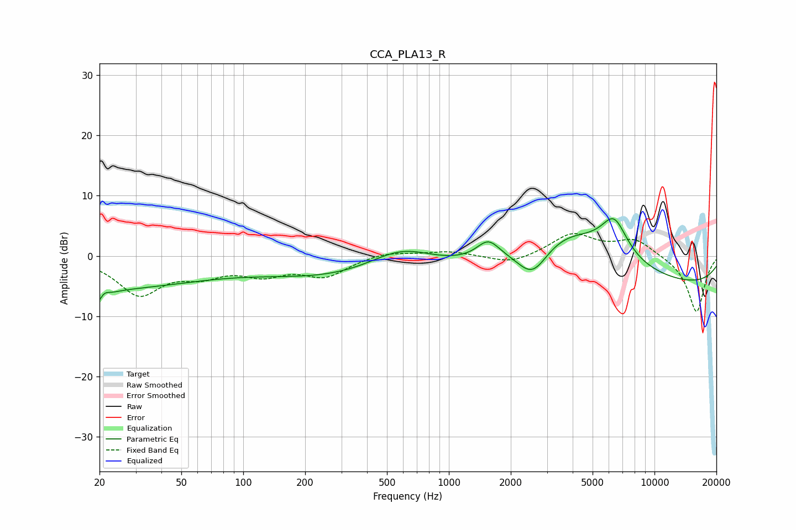

# CCA_PLA13_R
See [usage instructions](https://github.com/jaakkopasanen/AutoEq#usage) for more options and info.

### Parametric EQs
Apply preamp of -6.3 dB when using parametric equalizer.

|   # | Type    |   Fc (Hz) |    Q |   Gain (dB) |
|-----|---------|-----------|------|-------------|
|   1 | Peaking |        20 | 0.28 |        -5.3 |
|   2 | Peaking |        20 | 3.95 |        -4.6 |
|   3 | Peaking |        21 | 5.25 |         3.1 |
|   4 | Peaking |       474 | 0.27 |        -4.6 |
|   5 | Peaking |       590 | 0.81 |         4.9 |
|   6 | Peaking |      1553 | 2.59 |         3   |
|   7 | Peaking |      2554 | 1.75 |        -5.9 |
|   8 | Peaking |      3579 | 0.55 |         8.6 |
|   9 | Peaking |      6363 | 2.14 |         6.1 |
|  10 | Peaking |      9944 | 0.18 |        -5.2 |

### Fixed Band EQs
When using fixed band (also called graphic) equalizer, apply preamp of **-3.8 dB** (if available) and set gains manually with these parameters.

|   # | Type    |   Fc (Hz) |    Q |   Gain (dB) |
|-----|---------|-----------|------|-------------|
|   1 | Peaking |        31 | 1.41 |        -6.1 |
|   2 | Peaking |        62 | 1.41 |        -2.5 |
|   3 | Peaking |       125 | 1.41 |        -2.6 |
|   4 | Peaking |       250 | 1.41 |        -3.1 |
|   5 | Peaking |       500 | 1.41 |         0.8 |
|   6 | Peaking |      1000 | 1.41 |         0.8 |
|   7 | Peaking |      2000 | 1.41 |        -1.4 |
|   8 | Peaking |      4000 | 1.41 |         3.6 |
|   9 | Peaking |      8000 | 1.41 |         2.7 |
|  10 | Peaking |     16000 | 1.41 |        -9.4 |

### Graphs

