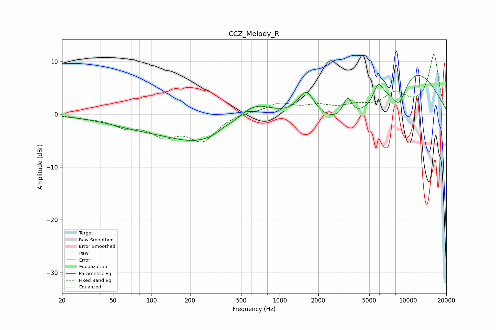

# CCZ_Melody_R
See [usage instructions](https://github.com/jaakkopasanen/AutoEq#usage) for more options and info.

### Parametric EQs
Apply preamp of -7.5 dB when using parametric equalizer.

|   # | Type    |   Fc (Hz) |    Q |   Gain (dB) |
|-----|---------|-----------|------|-------------|
|   1 | Peaking |        73 | 0.57 |        -1.6 |
|   2 | Peaking |       246 | 0.51 |        -5   |
|   3 | Peaking |       369 | 3.04 |         0.4 |
|   4 | Peaking |       628 | 1.02 |         3.6 |
|   5 | Peaking |      1616 | 2.18 |         5   |
|   6 | Peaking |      3385 | 3.93 |         3.9 |
|   7 | Peaking |      3784 | 0.56 |        -4.9 |
|   8 | Peaking |      5883 | 3.92 |         3.1 |
|   9 | Peaking |      8559 | 2.11 |        -5.5 |
|  10 | Peaking |      9894 | 0.43 |         9.9 |

### Fixed Band EQs
When using fixed band (also called graphic) equalizer, apply preamp of **-11.4 dB** (if available) and set gains manually with these parameters.

|   # | Type    |   Fc (Hz) |    Q |   Gain (dB) |
|-----|---------|-----------|------|-------------|
|   1 | Peaking |        31 | 1.41 |        -0.5 |
|   2 | Peaking |        62 | 1.41 |        -2   |
|   3 | Peaking |       125 | 1.41 |        -3.5 |
|   4 | Peaking |       250 | 1.41 |        -4.7 |
|   5 | Peaking |       500 | 1.41 |         0.4 |
|   6 | Peaking |      1000 | 1.41 |         1.9 |
|   7 | Peaking |      2000 | 1.41 |         1.3 |
|   8 | Peaking |      4000 | 1.41 |         1.3 |
|   9 | Peaking |      8000 | 1.41 |         3.5 |
|  10 | Peaking |     16000 | 1.41 |        11.2 |

### Graphs

