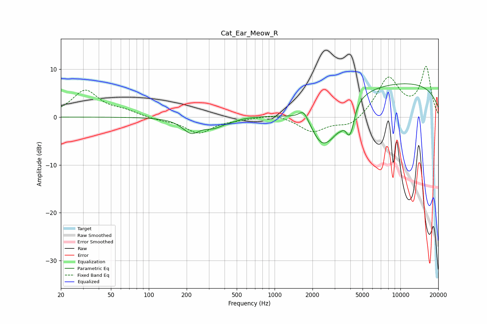

# Cat_Ear_Meow_R
See [usage instructions](https://github.com/jaakkopasanen/AutoEq#usage) for more options and info.

### Parametric EQs
Apply preamp of -7.0 dB when using parametric equalizer.

|   # | Type    |   Fc (Hz) |    Q |   Gain (dB) |
|-----|---------|-----------|------|-------------|
|   1 | Peaking |       217 | 2.01 |        -3   |
|   2 | Peaking |       330 | 1.9  |        -1.6 |
|   3 | Peaking |       445 | 2.47 |        -0.4 |
|   4 | Peaking |      1704 | 3.64 |         2.5 |
|   5 | Peaking |      2373 | 1.52 |        -7.5 |
|   6 | Peaking |      2916 | 2.18 |        -2.6 |
|   7 | Peaking |      3368 | 4.86 |        -1   |
|   8 | Peaking |      3887 | 4.81 |        -4.2 |
|   9 | Peaking |      4126 | 5.5  |        -2.3 |
|  10 | Peaking |      9880 | 0.21 |         7.1 |

### Fixed Band EQs
When using fixed band (also called graphic) equalizer, apply preamp of **-10.7 dB** (if available) and set gains manually with these parameters.

|   # | Type    |   Fc (Hz) |    Q |   Gain (dB) |
|-----|---------|-----------|------|-------------|
|   1 | Peaking |        31 | 1.41 |         5.5 |
|   2 | Peaking |        62 | 1.41 |         1.1 |
|   3 | Peaking |       125 | 1.41 |        -0.5 |
|   4 | Peaking |       250 | 1.41 |        -3.3 |
|   5 | Peaking |       500 | 1.41 |        -0.3 |
|   6 | Peaking |      1000 | 1.41 |         0.8 |
|   7 | Peaking |      2000 | 1.41 |        -3.1 |
|   8 | Peaking |      4000 | 1.41 |        -2.1 |
|   9 | Peaking |      8000 | 1.41 |         8.1 |
|  10 | Peaking |     16000 | 1.41 |        10.2 |

### Graphs

