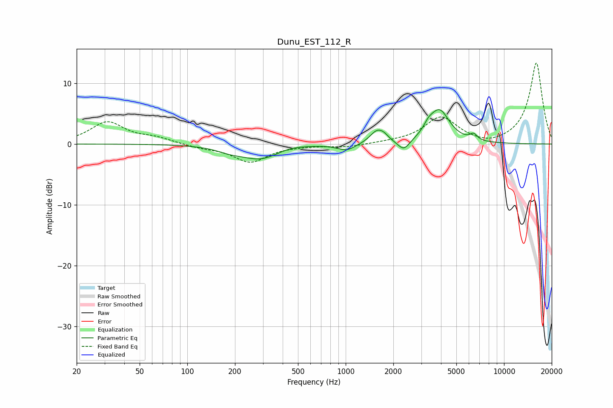

# Dunu_EST_112_R
See [usage instructions](https://github.com/jaakkopasanen/AutoEq#usage) for more options and info.

### Parametric EQs
Apply preamp of -5.8 dB when using parametric equalizer.

|   # | Type    |   Fc (Hz) |    Q |   Gain (dB) |
|-----|---------|-----------|------|-------------|
|   1 | Peaking |       184 | 1.83 |        -0.6 |
|   2 | Peaking |       294 | 1.08 |        -2.6 |
|   3 | Peaking |       427 | 1.32 |         0.6 |
|   4 | Peaking |      1013 | 2.52 |        -1.1 |
|   5 | Peaking |      1584 | 3.16 |         2.1 |
|   6 | Peaking |      1755 | 5.18 |         0.5 |
|   7 | Peaking |      2329 | 3.74 |        -1.8 |
|   8 | Peaking |      3329 | 5    |         1   |
|   9 | Peaking |      3904 | 2.18 |         5.4 |
|  10 | Peaking |      6433 | 5.99 |         1   |

### Fixed Band EQs
When using fixed band (also called graphic) equalizer, apply preamp of **-13.4 dB** (if available) and set gains manually with these parameters.

|   # | Type    |   Fc (Hz) |    Q |   Gain (dB) |
|-----|---------|-----------|------|-------------|
|   1 | Peaking |        31 | 1.41 |         3.5 |
|   2 | Peaking |        62 | 1.41 |         0.9 |
|   3 | Peaking |       125 | 1.41 |        -0.5 |
|   4 | Peaking |       250 | 1.41 |        -2.9 |
|   5 | Peaking |       500 | 1.41 |        -0.2 |
|   6 | Peaking |      1000 | 1.41 |        -0.5 |
|   7 | Peaking |      2000 | 1.41 |         0.2 |
|   8 | Peaking |      4000 | 1.41 |         4.3 |
|   9 | Peaking |      8000 | 1.41 |        -0.6 |
|  10 | Peaking |     16000 | 1.41 |        13.4 |

### Graphs

