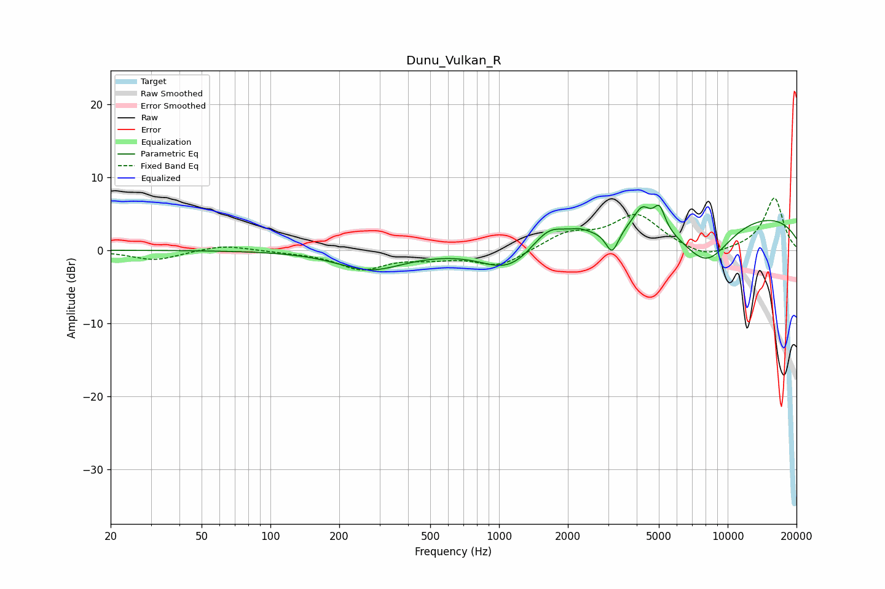

# Dunu_Vulkan_R
See [usage instructions](https://github.com/jaakkopasanen/AutoEq#usage) for more options and info.

### Parametric EQs
Apply preamp of -6.2 dB when using parametric equalizer.

|   # | Type    |   Fc (Hz) |    Q |   Gain (dB) |
|-----|---------|-----------|------|-------------|
|   1 | Peaking |       274 | 0.98 |        -2.6 |
|   2 | Peaking |      1063 | 1.3  |        -2.9 |
|   3 | Peaking |      1261 | 2.04 |        -0.5 |
|   4 | Peaking |      1649 | 1.92 |         2.5 |
|   5 | Peaking |      2241 | 3.91 |         0.5 |
|   6 | Peaking |      3124 | 4.96 |        -3.4 |
|   7 | Peaking |      4226 | 3.71 |         2.9 |
|   8 | Peaking |      5034 | 5.72 |         3   |
|   9 | Peaking |      8039 | 1.14 |        -6.5 |
|  10 | Peaking |     10000 | 0.2  |         5.4 |

### Fixed Band EQs
When using fixed band (also called graphic) equalizer, apply preamp of **-7.2 dB** (if available) and set gains manually with these parameters.

|   # | Type    |   Fc (Hz) |    Q |   Gain (dB) |
|-----|---------|-----------|------|-------------|
|   1 | Peaking |        31 | 1.41 |        -1.4 |
|   2 | Peaking |        62 | 1.41 |         0.8 |
|   3 | Peaking |       125 | 1.41 |        -0.2 |
|   4 | Peaking |       250 | 1.41 |        -2.5 |
|   5 | Peaking |       500 | 1.41 |        -0.8 |
|   6 | Peaking |      1000 | 1.41 |        -2.2 |
|   7 | Peaking |      2000 | 1.41 |         2.2 |
|   8 | Peaking |      4000 | 1.41 |         4.7 |
|   9 | Peaking |      8000 | 1.41 |        -1.4 |
|  10 | Peaking |     16000 | 1.41 |         7.2 |

### Graphs

