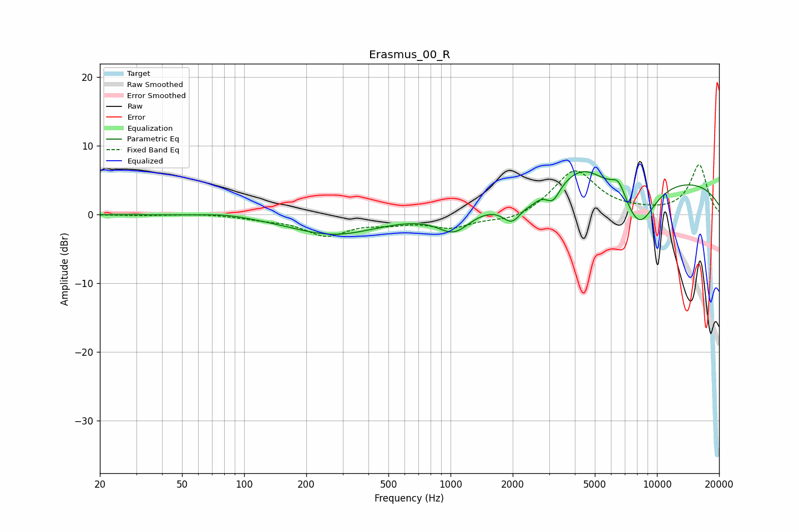

# Erasmus_00_R
See [usage instructions](https://github.com/jaakkopasanen/AutoEq#usage) for more options and info.

### Parametric EQs
Apply preamp of -6.3 dB when using parametric equalizer.

|   # | Type    |   Fc (Hz) |    Q |   Gain (dB) |
|-----|---------|-----------|------|-------------|
|   1 | Peaking |        82 | 1.22 |         0.4 |
|   2 | Peaking |       272 | 0.67 |        -2.9 |
|   3 | Peaking |      1040 | 1.78 |        -3.1 |
|   4 | Peaking |      1990 | 2.94 |        -3.2 |
|   5 | Peaking |      2466 | 4.34 |        -0.6 |
|   6 | Peaking |      3135 | 4.12 |        -2.4 |
|   7 | Peaking |      4359 | 1.39 |         2.7 |
|   8 | Peaking |      6520 | 3.93 |         2.4 |
|   9 | Peaking |      8172 | 1.58 |        -7   |
|  10 | Peaking |      8904 | 0.19 |         5.5 |

### Fixed Band EQs
When using fixed band (also called graphic) equalizer, apply preamp of **-7.3 dB** (if available) and set gains manually with these parameters.

|   # | Type    |   Fc (Hz) |    Q |   Gain (dB) |
|-----|---------|-----------|------|-------------|
|   1 | Peaking |        31 | 1.41 |        -0.1 |
|   2 | Peaking |        62 | 1.41 |         0.2 |
|   3 | Peaking |       125 | 1.41 |        -0.5 |
|   4 | Peaking |       250 | 1.41 |        -2.9 |
|   5 | Peaking |       500 | 1.41 |        -0.9 |
|   6 | Peaking |      1000 | 1.41 |        -1.8 |
|   7 | Peaking |      2000 | 1.41 |        -1.1 |
|   8 | Peaking |      4000 | 1.41 |         6.5 |
|   9 | Peaking |      8000 | 1.41 |         0.3 |
|  10 | Peaking |     16000 | 1.41 |         7.2 |

### Graphs

