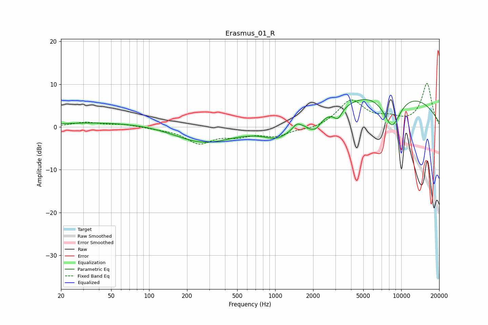

# Erasmus_01_R
See [usage instructions](https://github.com/jaakkopasanen/AutoEq#usage) for more options and info.

### Parametric EQs
Apply preamp of -6.5 dB when using parametric equalizer.

|   # | Type    |   Fc (Hz) |    Q |   Gain (dB) |
|-----|---------|-----------|------|-------------|
|   1 | Peaking |        67 | 0.23 |         1.2 |
|   2 | Peaking |       265 | 0.61 |        -4.2 |
|   3 | Peaking |      1049 | 1.31 |        -2.8 |
|   4 | Peaking |      1487 | 4.58 |         1.2 |
|   5 | Peaking |      1872 | 4.66 |        -0.8 |
|   6 | Peaking |      2107 | 3.67 |        -2.1 |
|   7 | Peaking |      3145 | 4.24 |        -2.4 |
|   8 | Peaking |      5244 | 0.64 |         2.1 |
|   9 | Peaking |      8431 | 1.75 |        -8.4 |
|  10 | Peaking |      9432 | 0.3  |         7.7 |

### Fixed Band EQs
When using fixed band (also called graphic) equalizer, apply preamp of **-10.3 dB** (if available) and set gains manually with these parameters.

|   # | Type    |   Fc (Hz) |    Q |   Gain (dB) |
|-----|---------|-----------|------|-------------|
|   1 | Peaking |        31 | 1.41 |         1   |
|   2 | Peaking |        62 | 1.41 |         0.6 |
|   3 | Peaking |       125 | 1.41 |        -0.3 |
|   4 | Peaking |       250 | 1.41 |        -3.6 |
|   5 | Peaking |       500 | 1.41 |        -1.7 |
|   6 | Peaking |      1000 | 1.41 |        -2   |
|   7 | Peaking |      2000 | 1.41 |        -0.6 |
|   8 | Peaking |      4000 | 1.41 |         6.1 |
|   9 | Peaking |      8000 | 1.41 |         1.6 |
|  10 | Peaking |     16000 | 1.41 |        10.1 |

### Graphs

