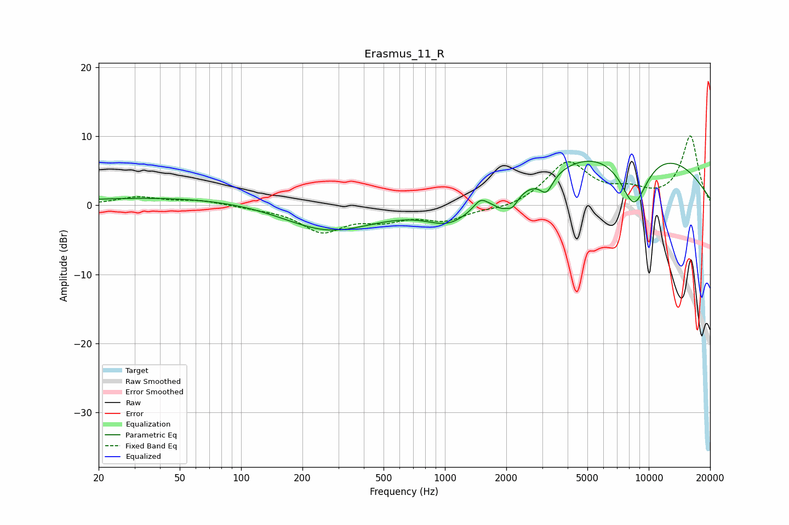

# Erasmus_11_R
See [usage instructions](https://github.com/jaakkopasanen/AutoEq#usage) for more options and info.

### Parametric EQs
Apply preamp of -6.5 dB when using parametric equalizer.

|   # | Type    |   Fc (Hz) |    Q |   Gain (dB) |
|-----|---------|-----------|------|-------------|
|   1 | Peaking |        58 | 0.23 |         1.3 |
|   2 | Peaking |       265 | 0.62 |        -4.1 |
|   3 | Peaking |      1050 | 1.29 |        -2.8 |
|   4 | Peaking |      1494 | 4.37 |         1.4 |
|   5 | Peaking |      1880 | 3.89 |        -1.2 |
|   6 | Peaking |      2139 | 4.65 |        -1.8 |
|   7 | Peaking |      3148 | 4.45 |        -2.5 |
|   8 | Peaking |      4632 | 0.76 |         1.9 |
|   9 | Peaking |      8461 | 1.82 |        -8.2 |
|  10 | Peaking |      9415 | 0.33 |         8   |

### Fixed Band EQs
When using fixed band (also called graphic) equalizer, apply preamp of **-10.1 dB** (if available) and set gains manually with these parameters.

|   # | Type    |   Fc (Hz) |    Q |   Gain (dB) |
|-----|---------|-----------|------|-------------|
|   1 | Peaking |        31 | 1.41 |         1.2 |
|   2 | Peaking |        62 | 1.41 |         0.7 |
|   3 | Peaking |       125 | 1.41 |        -0.3 |
|   4 | Peaking |       250 | 1.41 |        -3.6 |
|   5 | Peaking |       500 | 1.41 |        -1.7 |
|   6 | Peaking |      1000 | 1.41 |        -2   |
|   7 | Peaking |      2000 | 1.41 |        -0.7 |
|   8 | Peaking |      4000 | 1.41 |         6.1 |
|   9 | Peaking |      8000 | 1.41 |         1.6 |
|  10 | Peaking |     16000 | 1.41 |        10   |

### Graphs

