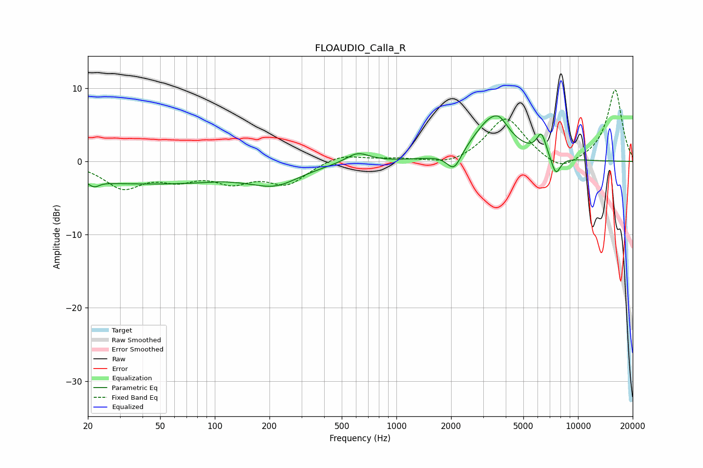

# FLOAUDIO_Calla_R
See [usage instructions](https://github.com/jaakkopasanen/AutoEq#usage) for more options and info.

### Parametric EQs
Apply preamp of -6.3 dB when using parametric equalizer.

|   # | Type    |   Fc (Hz) |    Q |   Gain (dB) |
|-----|---------|-----------|------|-------------|
|   1 | Peaking |        22 | 5.42 |        -0.7 |
|   2 | Peaking |        40 | 0.24 |        -3   |
|   3 | Peaking |       109 | 2.85 |         0.1 |
|   4 | Peaking |       217 | 1.08 |        -2.2 |
|   5 | Peaking |       611 | 2.18 |         1.4 |
|   6 | Peaking |      2079 | 3.52 |        -2.7 |
|   7 | Peaking |      3355 | 1.36 |         5.6 |
|   8 | Peaking |      3703 | 3.66 |         1   |
|   9 | Peaking |      6286 | 5.13 |         2.9 |
|  10 | Peaking |      7548 | 5.09 |        -2.6 |

### Fixed Band EQs
When using fixed band (also called graphic) equalizer, apply preamp of **-9.8 dB** (if available) and set gains manually with these parameters.

|   # | Type    |   Fc (Hz) |    Q |   Gain (dB) |
|-----|---------|-----------|------|-------------|
|   1 | Peaking |        31 | 1.41 |        -3.4 |
|   2 | Peaking |        62 | 1.41 |        -2   |
|   3 | Peaking |       125 | 1.41 |        -2.4 |
|   4 | Peaking |       250 | 1.41 |        -2.9 |
|   5 | Peaking |       500 | 1.41 |         1.1 |
|   6 | Peaking |      1000 | 1.41 |         0.3 |
|   7 | Peaking |      2000 | 1.41 |        -0.8 |
|   8 | Peaking |      4000 | 1.41 |         6   |
|   9 | Peaking |      8000 | 1.41 |        -1.8 |
|  10 | Peaking |     16000 | 1.41 |         9.8 |

### Graphs

