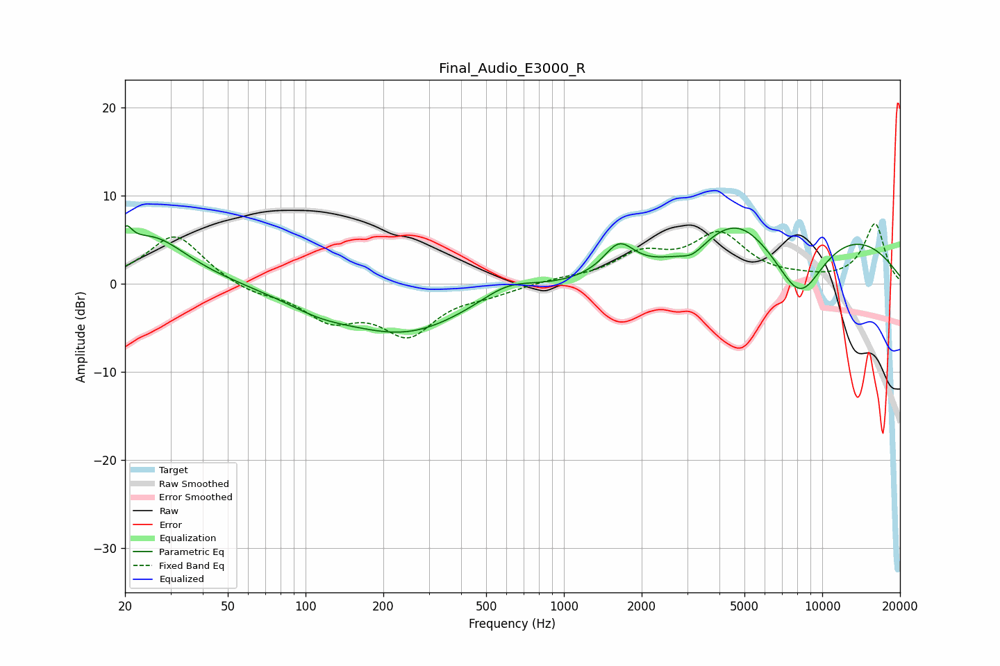

# Final_Audio_E3000_R
See [usage instructions](https://github.com/jaakkopasanen/AutoEq#usage) for more options and info.

### Parametric EQs
Apply preamp of -6.7 dB when using parametric equalizer.

|   # | Type    |   Fc (Hz) |    Q |   Gain (dB) |
|-----|---------|-----------|------|-------------|
|   1 | Peaking |        20 | 5.99 |         2.3 |
|   2 | Peaking |        25 | 1    |         5.3 |
|   3 | Peaking |       112 | 1.04 |        -1.4 |
|   4 | Peaking |       245 | 0.56 |        -5.4 |
|   5 | Peaking |       603 | 1.36 |         1.7 |
|   6 | Peaking |      1634 | 2.38 |         3.5 |
|   7 | Peaking |      3145 | 3.08 |        -1.1 |
|   8 | Peaking |      4620 | 1.07 |         4.1 |
|   9 | Peaking |      8175 | 1.25 |        -8.1 |
|  10 | Peaking |     10000 | 0.33 |         6.5 |

### Fixed Band EQs
When using fixed band (also called graphic) equalizer, apply preamp of **-6.9 dB** (if available) and set gains manually with these parameters.

|   # | Type    |   Fc (Hz) |    Q |   Gain (dB) |
|-----|---------|-----------|------|-------------|
|   1 | Peaking |        31 | 1.41 |         5.7 |
|   2 | Peaking |        62 | 1.41 |        -1.1 |
|   3 | Peaking |       125 | 1.41 |        -3.6 |
|   4 | Peaking |       250 | 1.41 |        -5.4 |
|   5 | Peaking |       500 | 1.41 |        -0.9 |
|   6 | Peaking |      1000 | 1.41 |         0.4 |
|   7 | Peaking |      2000 | 1.41 |         3   |
|   8 | Peaking |      4000 | 1.41 |         5.3 |
|   9 | Peaking |      8000 | 1.41 |         0.3 |
|  10 | Peaking |     16000 | 1.41 |         6.8 |

### Graphs

