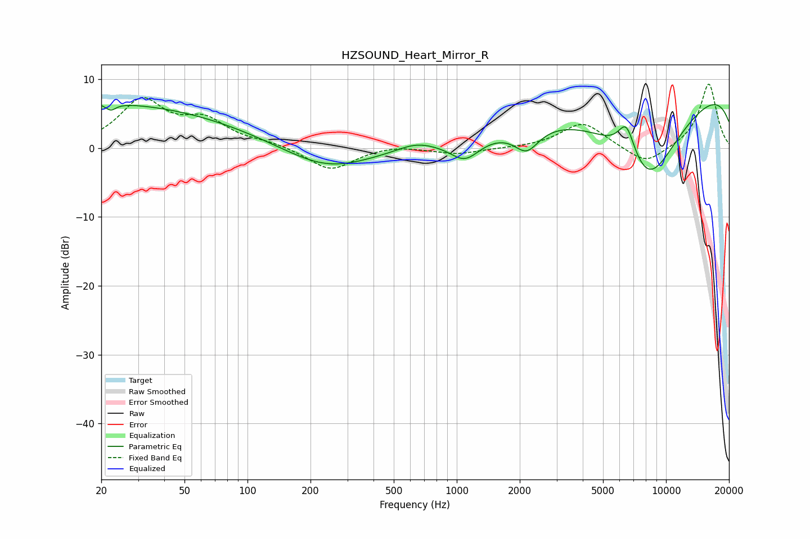

# HZSOUND_Heart_Mirror_R
See [usage instructions](https://github.com/jaakkopasanen/AutoEq#usage) for more options and info.

### Parametric EQs
Apply preamp of -6.4 dB when using parametric equalizer.

|   # | Type    |   Fc (Hz) |    Q |   Gain (dB) |
|-----|---------|-----------|------|-------------|
|   1 | Peaking |        20 | 0.19 |         6.9 |
|   2 | Peaking |        22 | 5.82 |        -1   |
|   3 | Peaking |       125 | 0.21 |        -0.6 |
|   4 | Peaking |       239 | 0.71 |        -3   |
|   5 | Peaking |       638 | 1.57 |         1   |
|   6 | Peaking |      1095 | 1.97 |        -3.1 |
|   7 | Peaking |      2157 | 2.38 |        -3.4 |
|   8 | Peaking |      6468 | 3.31 |         4.9 |
|   9 | Peaking |      8199 | 0.65 |       -15.9 |
|  10 | Peaking |     10000 | 0.18 |        12.1 |

### Fixed Band EQs
When using fixed band (also called graphic) equalizer, apply preamp of **-9.4 dB** (if available) and set gains manually with these parameters.

|   # | Type    |   Fc (Hz) |    Q |   Gain (dB) |
|-----|---------|-----------|------|-------------|
|   1 | Peaking |        31 | 1.41 |         6.7 |
|   2 | Peaking |        62 | 1.41 |         3.5 |
|   3 | Peaking |       125 | 1.41 |         0.6 |
|   4 | Peaking |       250 | 1.41 |        -3.3 |
|   5 | Peaking |       500 | 1.41 |         0.5 |
|   6 | Peaking |      1000 | 1.41 |        -0.9 |
|   7 | Peaking |      2000 | 1.41 |        -0   |
|   8 | Peaking |      4000 | 1.41 |         3.7 |
|   9 | Peaking |      8000 | 1.41 |        -2.6 |
|  10 | Peaking |     16000 | 1.41 |         9.4 |

### Graphs

