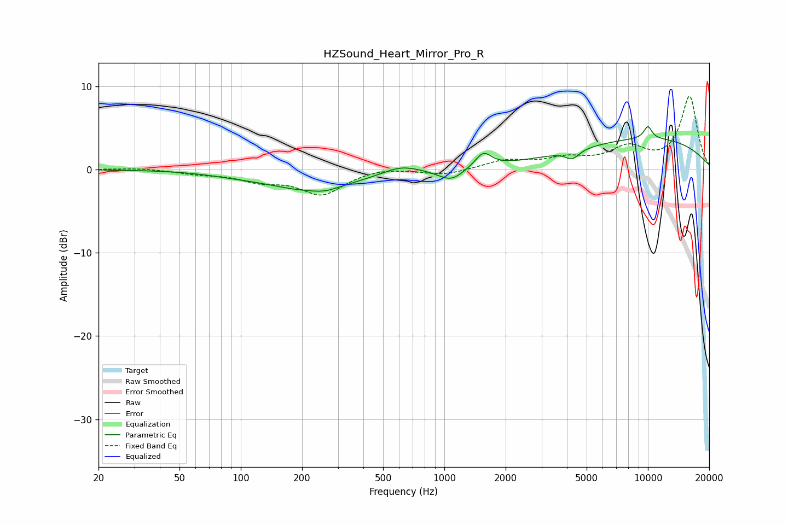

# HZSound_Heart_Mirror_Pro_R
See [usage instructions](https://github.com/jaakkopasanen/AutoEq#usage) for more options and info.

### Parametric EQs
Apply preamp of -5.3 dB when using parametric equalizer.

|   # | Type    |   Fc (Hz) |    Q |   Gain (dB) |
|-----|---------|-----------|------|-------------|
|   1 | Peaking |        89 | 1.27 |        -0.2 |
|   2 | Peaking |       220 | 0.63 |        -2.4 |
|   3 | Peaking |       259 | 2.44 |        -0.3 |
|   4 | Peaking |       612 | 1.56 |         1   |
|   5 | Peaking |      1095 | 2.12 |        -1.7 |
|   6 | Peaking |      1227 | 2.84 |         0.2 |
|   7 | Peaking |      1553 | 3.55 |         1.8 |
|   8 | Peaking |      4249 | 4.19 |        -1.1 |
|   9 | Peaking |     10000 | 0.31 |         3.7 |
|  10 | Peaking |     10000 | 6    |         1.5 |

### Fixed Band EQs
When using fixed band (also called graphic) equalizer, apply preamp of **-8.9 dB** (if available) and set gains manually with these parameters.

|   # | Type    |   Fc (Hz) |    Q |   Gain (dB) |
|-----|---------|-----------|------|-------------|
|   1 | Peaking |        31 | 1.41 |         0.2 |
|   2 | Peaking |        62 | 1.41 |        -0.4 |
|   3 | Peaking |       125 | 1.41 |        -1.2 |
|   4 | Peaking |       250 | 1.41 |        -2.9 |
|   5 | Peaking |       500 | 1.41 |         0.4 |
|   6 | Peaking |      1000 | 1.41 |        -0.7 |
|   7 | Peaking |      2000 | 1.41 |         1   |
|   8 | Peaking |      4000 | 1.41 |         1.1 |
|   9 | Peaking |      8000 | 1.41 |         2.4 |
|  10 | Peaking |     16000 | 1.41 |         8.7 |

### Graphs

