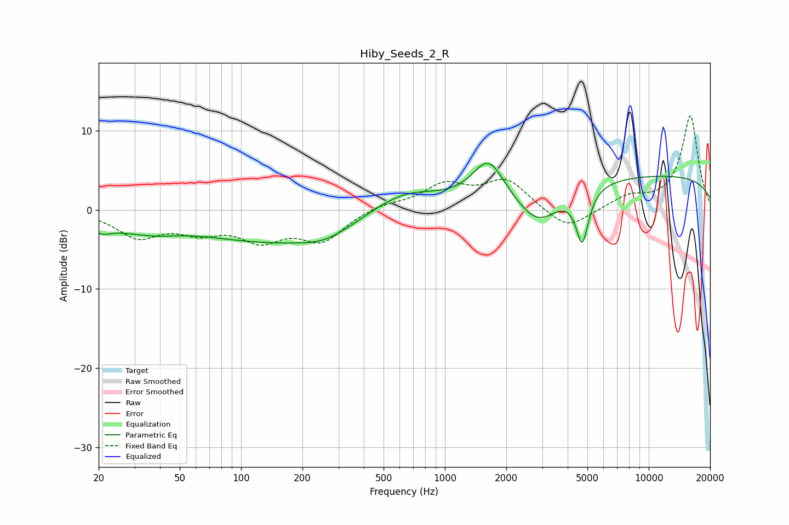

# Hiby_Seeds_2_R
See [usage instructions](https://github.com/jaakkopasanen/AutoEq#usage) for more options and info.

### Parametric EQs
Apply preamp of -6.0 dB when using parametric equalizer.

|   # | Type    |   Fc (Hz) |    Q |   Gain (dB) |
|-----|---------|-----------|------|-------------|
|   1 | Peaking |        21 | 4.5  |        -0.6 |
|   2 | Peaking |        21 | 0.89 |        -1.5 |
|   3 | Peaking |        37 | 1.12 |        -1.2 |
|   4 | Peaking |       147 | 0.36 |        -3.9 |
|   5 | Peaking |       258 | 1.18 |        -1.2 |
|   6 | Peaking |       624 | 0.83 |         2.8 |
|   7 | Peaking |      1633 | 1.82 |         5.2 |
|   8 | Peaking |      2857 | 1.33 |        -4.6 |
|   9 | Peaking |      4719 | 4.51 |        -6.7 |
|  10 | Peaking |     10000 | 0.18 |         4.4 |

### Fixed Band EQs
When using fixed band (also called graphic) equalizer, apply preamp of **-12.0 dB** (if available) and set gains manually with these parameters.

|   # | Type    |   Fc (Hz) |    Q |   Gain (dB) |
|-----|---------|-----------|------|-------------|
|   1 | Peaking |        31 | 1.41 |        -3.2 |
|   2 | Peaking |        62 | 1.41 |        -2.2 |
|   3 | Peaking |       125 | 1.41 |        -3.3 |
|   4 | Peaking |       250 | 1.41 |        -3.7 |
|   5 | Peaking |       500 | 1.41 |         0.7 |
|   6 | Peaking |      1000 | 1.41 |         3   |
|   7 | Peaking |      2000 | 1.41 |         3.7 |
|   8 | Peaking |      4000 | 1.41 |        -2.7 |
|   9 | Peaking |      8000 | 1.41 |         1.5 |
|  10 | Peaking |     16000 | 1.41 |        11.9 |

### Graphs

